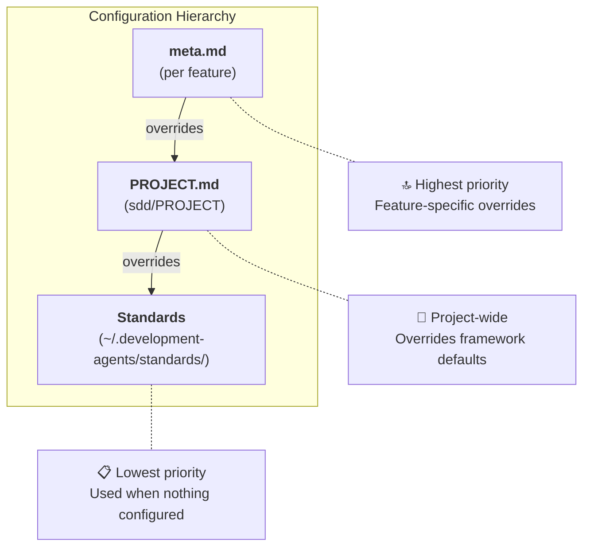

# Configuration Hierarchy

**Framework**: SDD Kit
**Last Updated**: 2025-01-02

---

## Overview

SDD Kit follows **convention over configuration**. The framework provides sensible defaults that work for most projects. You only need to configure what you want to change.

> **Coming from SpecKit?** `PROJECT.md` is equivalent to SpecKit's `constitution.md`. Same concept, different name.

---

## The Three Layers



**Resolution order**: meta.md → PROJECT.md → Framework Standards

---

## Layer 1: Framework Standards (Defaults)

**Location**: `~/.development-agents/standards/`

These files define the **default values** used when nothing is configured:

| Standard | Default Values |
|----------|---------------|
| `testing-strategy.md` | 80% coverage, unit/integration/e2e ratios |
| `tech-stack.md` | Recommended libraries per language |
| `coding-standards.md` | Formatting, naming conventions |
| `coding-standards.md` |  project service recommendations |

**You don't edit these files**. They're part of the framework and get updated when you upgrade.

### governance.md - Special Case

`governance.md` defines **principles**, not configuration:

- Specification-first development
- AI-human collaboration model
- Quality gates are mandatory
- Testing is required
- Command safety rules

These are the **philosophy** of the framework. The numeric values mentioned (like "80% coverage") are references to the defaults in other standards, not configuration.

---

## Layer 2: PROJECT.md (Project Customization)

**Location**: `sdd/PROJECT.md`

This is where your team customizes the framework for your project.

### Convention Over Configuration

The template is **empty by default** (all sections commented out):

```yaml
# Uncomment only what you need to change

# coverage:
#   min_coverage: 80  ← Only uncomment if you need different value
```

**If not configured → Framework default is used**

### What You Can Configure

| Section | Purpose | Example Override |
|---------|---------|-----------------|
| `language` | Spec/comment language | `specs: es` for Spanish |
| `preferences` | Tech preferences | `orm: mybatis` instead of jpa |
| `coverage` | Test thresholds | `min_coverage: 60` for legacy |
| `reviews` | Review requirements | `code_review: optional` |
| `defaults` | Feature defaults | `e2e_enabled: false` |
| `forbidden` | Banned libraries | `- lombok` |

### Registering Overrides

When you configure a value that conflicts with framework standards, you should register it:

```yaml
overrides:
  - standard: testing-strategy.md
    rule: "Minimum coverage 80%"
    project_value: 50
    reason: "Legacy codebase, gradual improvement plan"
    registered_at: 2025-01-02
    registered_by: ddelgado
```

**Why register?**
- Documents the intentional deviation
- Prevents validation warnings
- Helps future maintainers understand decisions

### Validation

Run `/sdd.check --project` to:
- Detect unregistered conflicts
- Suggest override registration
- Verify PROJECT.md syntax

---

---

## PATTERNS.md - Project Knowledge Base

**Location**: `sdd/PATTERNS.md`

While PROJECT.md defines **team conventions** (architecture, coverage, language), PATTERNS.md accumulates **project learnings** (gotchas, best practices, internal libraries).

### How PATTERNS.md Works

| Source | When | Section |
|--------|------|---------|
| `/sdd.finish` | After completing feature | Technology sections (Go, Java, etc.) |
| `/sdd.project patterns` | Anytime (manual) | "Team Conventions" section |

### Adding Patterns Manually

Use `/sdd.project patterns` to add team conventions before completing features:

```bash
# Interactive wizard
/sdd.project patterns --add

# From description (AI-inferred)
/sdd.project patterns "usar axios en vez de fetch, moment.js prohibido"

# View current patterns
/sdd.project patterns
```

### Pattern Format

```markdown
**[Pattern Name]**:
- [What to do]
- [What not to do]
- Why: [Rationale]
- Example: [Optional code snippet]
```

### When to Use Each

| Need | Use |
|------|-----|
| Team prefers specific architecture | `PROJECT.md` → `preferences.architecture` |
| Team must use internal library X | `PATTERNS.md` → via `/sdd.project patterns --add` |
| Learned gotcha during feature | `PATTERNS.md` → auto-promoted by `/sdd.finish` |
| Ban a specific library | `PROJECT.md` → `forbidden` section |

### Reading Patterns

Patterns are automatically loaded in `/sdd.start` (Step 10) and influence:
- Technical spec generation (`/sdd.spec technical`)
- Task planning (`/sdd.plan`)
- Implementation decisions (`/sdd.build`)

---

## Layer 3: meta.md (Feature Override)

**Location**: `sdd/wip/<feature>/meta.md`

Override project settings for a specific feature only.

### Use Cases

```yaml
# Feature that needs different settings than project default

testing:
  e2e_enabled: true
coverage:
  min_coverage: 85
```

### When to Use

- A single feature needs a different E2E or coverage override than PROJECT.md
- Document intentional deviations via `overrides` when they conflict with standards

> Do **not** invent prototype/MVP modes or set coverage to 0 to skip `/sdd.test`.

---

## Examples

### Example 1: New Project (Use All Defaults)

```
sdd/PROJECT.md → Empty (all commented)
Result: Framework defaults apply (80% coverage, mandatory reviews, etc.)
```

### Example 2: Legacy Project (Override Coverage)

```yaml
# sdd/PROJECT.md
coverage:
  min_coverage: 50

overrides:
  - standard: testing-strategy.md
    rule: "Minimum coverage 80%"
    project_value: 50
    reason: "Legacy codebase with 45% current coverage"
```

### Example 3: Feature-level E2E override

```yaml
# sdd/PROJECT.md
defaults:
  e2e_enabled: false

# sdd/wip/payment-flow/meta.md
testing:
  e2e_enabled: true     # This feature only
```

---

## Quick Reference

| I want to... | Where to configure |
|--------------|-------------------|
| Change project-wide coverage | `sdd/PROJECT.md` → `coverage.min_coverage` |
| Enable E2E for one feature | `meta.md` → `testing.e2e_enabled: true` |
| Ban a library project-wide | `sdd/PROJECT.md` → `forbidden` |
| Use Spanish for specs | `sdd/PROJECT.md` → `language.specs: es` |
| See current defaults | `~/.development-agents/standards/` |

---

## MCP Environment Variables

Some MCP servers require authentication tokens set as environment variables. This framework
does not hardcode a specific auth token/proxy — configure whatever your org's internal MCP
servers require (declare it in `sdd/PROJECT.md` if agents need to know about it).

**Typical pattern** (adapt to your org):
1. An auth proxy or CLI handles token injection/refresh automatically, if your org provides one
2. Otherwise, set the required environment variable(s) per your MCP server's documentation
3. If authentication fails repeatedly, verify you're logged in with your org's tooling and
   check the MCP server's own docs for troubleshooting
4. For Atlassian Jira/Confluence read-only setup, prefer `/sdd.mcp` (see [MCP_SETUP_GUIDE.md](./MCP_SETUP_GUIDE.md)). If MCP auth is unavailable, `/sdd.spec --include` falls back to paste-manual.

---

## Related Documents

- [governance.md](./standards/governance.md) - Framework principles
- [testing-strategy.md](./standards/testing-strategy.md) - Testing defaults
- [PROJECT.md Template](./templates/project.md) - Configuration template
- [genai-validate-project.sh](./tools/genai/genai-validate-project.sh) - PROJECT.md validation
