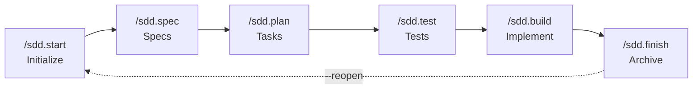

# SDD Pipeline — Canonical Source

> **Single source of truth** for the phase pipeline and gates. `AGENTS.md`, `WORKFLOW.md`,
> `COMMANDS.md`, `QUICK_REFERENCE.md`, and `skills/sdd-kit-expert/SKILL.md` all link here
> instead of repeating the full diagram/gate table. **When the pipeline changes (e.g. a new
> gate is added), update it here first**, then re-check the short one-liners in the other docs.

## Standard flow

```
/sdd.start
  → /sdd.spec           (Gate 1: approve functional + technical spec)
  → /sdd.plan            (Gate 2: approve tasks)
  → /sdd.test            (Gate 2.5: approve tests — tests-first, red phase)
  → /sdd.build           (implement until tests pass → validate)
  → /sdd.check
  → /sdd.finish          (Gate 3: completion & archive)
```

Shortcut: `/sdd.go` orchestrates `start → … → finish` in express mode (includes `/sdd.test`).

## Diagram



## Gates

| Gate | Command | What is approved |
|------|---------|-------------------|
| 1 | `/sdd.spec` | Functional + technical spec |
| 2 | `/sdd.plan` | Task breakdown & implementation strategy |
| 2.5 | `/sdd.test` | Failing tests (red phase) — approved BEFORE implementation |
| 3 | `/sdd.finish` | Final validation & archive |

## Execution modes

| Mode | Commands | Best for |
|------|----------|----------|
| **Express** | `/sdd.go "description"` (1 command) | Simple features, prototypes |
| **Standard** | `/sdd.start` → `/sdd.spec` → `/sdd.plan` → `/sdd.test` → `/sdd.build` → `/sdd.finish` | Most features (default) |

> `/sdd.test` is auto-skipped for `project_type: prototype` (see `meta.md` → `stages.tests.status: skipped`).

## Reopen

After `/sdd.finish`, use `/sdd.start --reopen [NNN]` to bring a completed feature back to WIP.
See `commands/sdd.start.md` and `commands/references/reopen-workflow.md` for the full R1-R7 workflow.

## Roles

| Role | Where |
|------|-------|
| Spec Writer | `/sdd.spec` (+ agent `sdd-explorer`) |
| Architect | agent `sdd-system-designer` + `/sdd.plan` |
| Developer | agent `sdd-implementer` |
| Test Writer | `/sdd.test` + agents `sdd-small-test-writer`, `sdd-large-test-writer` (E2E optional) |
| Code Reviewer | skill `sdd-code-reviewer` + agent `sdd-validator-runner` |
| Orchestrator | commands `/sdd.go`, `/sdd.start` + skill `sdd-kit-expert` |
| Installer | command `/sdd.install` + agent `development-agents-installer` |
