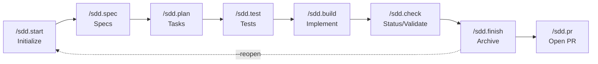

# SDD Pipeline — Canonical Source

> **Single source of truth** for the phase pipeline and gates. `AGENTS.md`, `WORKFLOW.md`,
> `COMMANDS.md`, `QUICK_REFERENCE.md`, and `skills/sdd-kit-expert/SKILL.md` all link here
> instead of repeating the full diagram/gate table. **When the pipeline changes (e.g. a new
> gate is added), update it here first**, then re-check the short one-liners in the other docs.

## Standard flow

```
/sdd.start
  → /sdd.spec           (Gate 1: approve functional + technical spec)
  → /sdd.plan            (Gate 2: approve tasks)
  → /sdd.test            (Gate 2.5: approve tests — tests-first, red phase)
  → /sdd.build           (implement until tests pass → validate)
  → /sdd.check
  → /sdd.finish          (Gate 3: completion & archive)
  → /sdd.pr              (optional: draft PR → human approve → gh create)
```

Shortcut: `/sdd.go` orchestrates `start → … → finish` in express mode (includes `/sdd.test`).  
PR is **not** part of `/sdd.go` — run `/sdd.pr` separately after finish when ready to merge.

> First-time walkthrough: [`framework/PLAYBOOK.md`](./PLAYBOOK.md)

## Diagram


```mermaid
graph LR
    A["/sdd.start<br/>Initialize"] --> B["/sdd.spec<br/>Specs"]
    B --> C["/sdd.plan<br/>Tasks"]
    C --> T["/sdd.test<br/>Tests"]
    T --> D["/sdd.build<br/>Implement"]
    D --> K["/sdd.check<br/>Status/Validate"]
    K --> E["/sdd.finish<br/>Archive"]
    E --> P["/sdd.pr<br/>Open PR"]
    E -.->|"--reopen"| A
```

## Gates

| Gate | Command       | What is approved                                           | Enforcement                                                                                  |
| ---- | ------------- | ---------------------------------------------------------- | -------------------------------------------------------------------------------------------- |
| 1    | `/sdd.spec`   | Functional + technical spec                                | Soft (`meta.md`) + process check when relevant                                               |
| 2    | `/sdd.plan`   | Task breakdown & implementation strategy                   | Soft (`tasks.json`) + process check when relevant                                            |
| 2.5  | `/sdd.test`   | Failing tests (red phase) — approved BEFORE implementation | Soft approval + **Process Compliance** via `sdd-validator` during build (no OS hooks) |
| 3    | `/sdd.finish` | Final validation & archive                                 | Soft + validator                                                                             |

> Process gates (LLM, portable): [`framework/HARD_GATES.md`](./HARD_GATES.md)

## Execution modes

| Mode         | Commands                                                                                             | Best for                                |
| ------------ | ---------------------------------------------------------------------------------------------------- | --------------------------------------- |
| **Express**  | `/sdd.go "description"` (1 command)                                                                  | Simple features with clear requirements |
| **Standard** | `/sdd.start` → `/sdd.spec` → `/sdd.plan` → `/sdd.test` → `/sdd.build` → `/sdd.check` → `/sdd.finish` | Most features (default)                 |

> `/sdd.test` is **never** skipped. Every feature must pass Gate 2.5 (tests approved, red verified) before `/sdd.build`.

## Reopen

After `/sdd.finish`, use `/sdd.start --reopen [NNN]` to bring a completed feature back to WIP.
See `commands/sdd.start.md` and `commands/references/reopen-workflow.md` for the full R1-R7 workflow.

## Roles

| Role                              | Where                                                                                   | Model Role |
| --------------------------------- | ----------------------------------------------------------------------------------------- | --- |
| Spec Writer                       | `/sdd.spec` (+ Skill `sdd-explorer`, `OFFLOAD_READ`)                                    | `STRONG` (`sdd-explorer` sub-step: `EXECUTION`) |
| Architect                         | Skill `sdd-system-design` (`OFFLOAD_REASONING`) + `/sdd.plan`                          | `STRONG` (`/sdd.plan` itself: `EXECUTION`) |
| Developer                         | Skill `sdd-implementation` (`ISOLATED_WORKSPACE`)                                       | `EXECUTION` (escalates to `STRONG` — see `model-routing.md`) |
| Test Writer                       | `/sdd.test` + Skill `sdd-test-writing` (`ISOLATED_WORKSPACE`; absorbs E2E as a lazy-loaded branch) | `STRONG` (default, not downgraded) |
| Code Reviewer / Process Validator | Skill `sdd-code-reviewer` + Skill `sdd-validator` (quality + Process Compliance; isolated mode requires `VALIDATOR_ISOLATED`) | `STRONG` (always, independent of isolation) |
| Orchestrator                      | commands `/sdd.go`, `/sdd.start` + Skill `sdd-kit-expert`                               | `inherit` (`/sdd.go`) / `EXECUTION` (`/sdd.start`, `sdd-kit-expert`) |
| Installer                         | command `/sdd.install` + Skill `sdd-installer` (bootstrap, runs inline)                 | `EXECUTION` |

Model Role (`STRONG`/`EXECUTION`) is a separate axis from execution requirement, resolved per
`framework/_shared/model-routing.md` — see that file for the full per-Skill table, escalation, and
per-harness concrete mapping.
