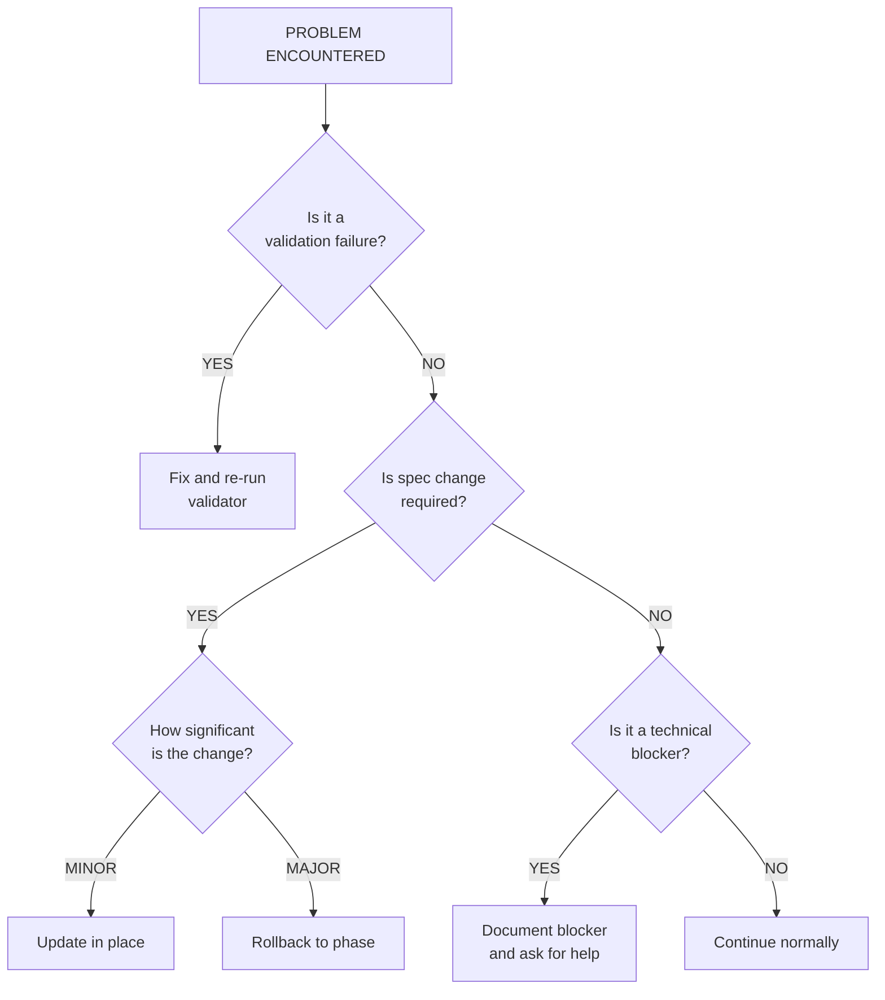

# Error Recovery Guide

**Purpose**: Guidance for recovering from failures and unexpected situations during feature development.

---

## Table of Contents

1. [Decision Tree](#decision-tree)
2. [Phase-Specific Recovery](#phase-specific-recovery)
3. [Common Failure Scenarios](#common-failure-scenarios)
4. [Rollback Procedures](#rollback-procedures)
5. [Recovery Commands](#recovery-commands)

---

## Decision Tree

Use this decision tree when you encounter a problem:



---

## Phase-Specific Recovery

### Phase 1: Functional Spec Failures

#### Validation Failed

```bash
# Check what failed
bash .development-agents/tools/validation/validate-functional.sh sdd/wip/[feature]

# Common fixes:
# - Missing sections: Add required sections to spec
# - Unclear acceptance criteria: Make them specific and testable
# - Missing user stories: Add at least one user story
```

**Recovery steps:**
1. Review validator output
2. Edit `1-functional/spec.md`
3. Re-run validator
4. If still failing, use `/sdd.spec functional --include` for Platform AI docs assistance

#### Stakeholder Rejected Spec

```
Situation: User/stakeholder says spec doesn't capture requirements correctly.

Recovery:
1. DO NOT proceed to Phase 2
2. Document feedback in spec under "## Feedback"
3. Schedule clarification session
4. Update spec based on feedback
5. Re-validate and get approval
```

---

### Phase 2: Technical Spec Failures

#### Validation Failed

```bash
# Check what failed
bash .development-agents/tools/validation/validate-technical.sh sdd/wip/[feature]

# Also check spec alignment
bash .development-agents/tools/validation/validate-spec-alignment.sh sdd/wip/[feature]
```

**Common issues and fixes:**

| Issue | Fix |
|-------|-----|
| Missing code compliance | Add project platform Platform compliance section |
| No architecture diagram | Create diagram in `2-technical/architecture.md` |
| Spec doesn't align with functional | Review functional spec, update technical |
| Missing security section | Add Security Considerations section |

#### Discovered Functional Gap

```
Situation: While writing technical spec, you discover the functional
spec is missing something important.

Recovery:
1. STOP technical spec work
2. Document the gap
3. Go back to Phase 1:
   - Update meta.md: Stage = "functional"
   - Edit functional spec
   - Re-validate functional spec
   - Get approval
4. Resume Phase 2
```

**Command:**
```bash
# Manually update stage in meta.md
sed -i 's/Stage: technical/Stage: functional/' sdd/wip/[feature]/meta.md
```

---

### Phase 3: Task Generation Failures

#### Circular Dependencies Detected

```
Situation: Validator found A → B → C → A cycle.

Recovery:
1. Review the cycle path in error message
2. Identify which dependency is incorrect
3. Usually one task doesn't actually depend on another
4. Edit tasks.json to remove the incorrect dependency
5. Re-run validator
```

**Example fix:**
```markdown
# Before (circular)
TASK-003 depends on: TASK-005
TASK-005 depends on: TASK-003

# After (fixed)
TASK-003 depends on: TASK-002
TASK-005 depends on: TASK-003
```

#### Tasks Don't Cover All Requirements

```
Situation: Review shows tasks are missing implementation for some
acceptance criteria.

Recovery:
1. Run spec alignment validator
2. Identify missing requirements
3. Use /sdd.plan --refine to add missing tasks
4. Re-validate
```

---

### Phase 4: Implementation Failures

#### Tests Failing

```
Situation: Implemented code but tests are failing.

Recovery (depending on cause):

1. Bug in implementation:
   - Fix the code
   - Re-run tests
   - Continue with next task

2. Test is wrong:
   - Review acceptance criteria
   - If test doesn't match AC, fix test
   - Document why test was changed

3. Spec was unclear:
   - Document the ambiguity
   - Make a decision (document it)
   - Or go back to clarify with stakeholder
```

#### Discovered Technical Limitation

```
Situation: During implementation, discovered something in technical
spec is not feasible.

Recovery:

1. Minor limitation (workaround exists):
   - Document the limitation in implementation notes
   - Implement workaround
   - Add to technical debt if needed
   - Continue

2. Major limitation (blocks feature):
   - STOP implementation
   - Document the limitation clearly
   - Options:
     a) Modify technical approach → Go back to Phase 2
     b) Modify functional requirements → Go back to Phase 1
     c) Cancel feature → Use /sdd.cancel
```

#### Mid-Implementation Requirement Change

```
Situation: Stakeholder requests changes while you're implementing.

Recovery:

1. Evaluate change size:

   SMALL (< 1 task worth of work):
   - Add new task for the change
   - Document in progress.md
   - Continue implementation

   MEDIUM (1-3 tasks):
   - Pause current work
   - Update technical spec
   - Generate new tasks
   - Re-estimate timeline
   - Get approval to continue

   LARGE (> 3 tasks or architectural change):
   - STOP current work
   - This is a scope change
   - Options:
     a) Complete current scope first, new change becomes new feature
     b) Rollback to Phase 1, incorporate change, restart
```

---

## Common Failure Scenarios

### Scenario 1: Validator Script Error

```
Problem: Validator crashes with bash error.

Fix:
1. Check bash version: bash --version (need 4.0+)
2. Check file permissions: ls -la .development-agents/tools/
3. Make executable: chmod +x .development-agents/tools/*.sh
4. Check file encoding: file validator.sh (should be ASCII/UTF-8)
```

### Scenario 2: Feature Stuck in Wrong Phase

```
Problem: meta.md shows wrong stage, commands don't work.

Fix:
1. Check current stage: cat sdd/wip/[feature]/meta.md
2. Manually correct: edit meta.md, set correct Stage
3. Ensure required files exist for that stage
4. Re-run appropriate validator
```

### Scenario 3: Merge Conflicts in Specs

```
Problem: Git merge conflict in spec files.

Fix:
1. Review both versions carefully
2. Merge manually, preserving all requirements
3. Re-validate after merge
4. Get stakeholder approval if requirements changed
```

### Scenario 4: Lost Work / Corrupted Files

```
Problem: Spec file corrupted or accidentally deleted.

Fix:
1. Check git: git status
2. Restore from git: git checkout -- sdd/wip/[feature]/path/to/file
3. If not in git, check backups
4. If no backup, reconstruct from memory/docs
5. Consider adding pre-commit hooks to prevent data loss
```

### Scenario 5: Compliance Checks Failing at Complete

```
Problem: /sdd.finish blocked by compliance validation.

Fix:
1. Run the code validator: bash .development-agents/tools/validation/validate-code.sh .
2. Review each error
3. Common fixes:
   - Add Dockerfile with the org-approved base image (see sdd/PROJECT.md)
   - Add Dockerfile.runtime with the org-approved base image (see sdd/PROJECT.md)
   - Implement health check endpoint (if required)
4. Re-run complete command
```

---

## Rollback Procedures

### Rollback to Previous Phase

```bash
# Rollback from Phase 4 → Phase 3
# (Discovered tasks need refinement)

1. Update meta.md stage:
   sed -i 's/Stage: implementation/Stage: tasks/' sdd/wip/[feature]/meta.md

2. Preserve implementation work:
   # Keep 4-implementation/ folder as-is
   # Add note to progress.md about rollback

3. Update tasks as needed

4. Re-approve tasks before continuing
```

### Rollback from Phase 3 → Phase 2

```bash
1. Update meta.md stage:
   sed -i 's/Stage: tasks/Stage: technical/' sdd/wip/[feature]/meta.md

2. Preserve tasks:
   # Keep 3-tasks/ folder
   # Tasks will be regenerated after tech spec update

3. Update technical spec

4. Regenerate tasks (they may change)
```

### Rollback from Phase 2 → Phase 1

```bash
1. Update meta.md stage:
   sed -i 's/Stage: technical/Stage: functional/' sdd/wip/[feature]/meta.md

2. Clear technical spec or preserve:
   # Option A: Remove to regenerate
   rm -rf sdd/wip/[feature]/2-technical/*

   # Option B: Keep for reference
   mv sdd/wip/[feature]/2-technical/spec.md \
      sdd/wip/[feature]/2-technical/spec.md.backup

3. Update functional spec

4. Get re-approval before proceeding
```

### Full Feature Restart

```bash
# When things are too broken to fix incrementally

1. Archive current state:
   mv sdd/wip/[feature] sdd/wip/[feature]-failed-$(date +%Y%m%d)

2. Start fresh:
   /sdd.start [feature]-v2

3. Reference old work:
   # Copy useful parts from archived version
   # Don't copy problems!
```

---

## Recovery Commands

### Quick Reference

| Situation | Command |
|-----------|---------|
| Check feature status | `/sdd.check [feature]` |
| Validate current phase | Run appropriate validator |
| Get Platform AI docs help with issues | `/sdd.spec functional --include` |
| Refine tasks | `/sdd.plan --refine` |
| Cancel feature | `/sdd.cancel [feature]` |

### Manual Stage Override

```bash
# Use when automated commands fail

# Check current stage
grep "Stage:" sdd/wip/[feature]/meta.md

# Override stage
sed -i 's/Stage: .*/Stage: [desired-stage]/' sdd/wip/[feature]/meta.md

# Valid stages: functional, technical, tasks, implementation
```

### Validate All Phases

```bash
# Full validation check

feature="[feature-name]"

echo "=== Validating Functional Spec ==="
bash .development-agents/tools/validation/validate-functional.sh sdd/wip/$feature

echo "=== Validating Technical Spec ==="
bash .development-agents/tools/validation/validate-technical.sh sdd/wip/$feature

echo "=== Validating Spec Alignment ==="
bash .development-agents/tools/validation/validate-spec-alignment.sh sdd/wip/$feature

echo "=== Validating Tasks ==="
bash .development-agents/tools/validation/validate-tasks.sh sdd/wip/$feature

echo "=== Validating Code Compliance ==="
bash .development-agents/tools/validation/validate-code.sh .
```

---

## Getting Help

If recovery procedures don't work:

1. **Document the problem clearly**
   - What were you trying to do?
   - What error/issue occurred?
   - What have you tried?

2. **Check logs and outputs**
   - Validator outputs
   - Git history
   - meta.md stage history

3. **Ask for help**
   - Provide the documentation above
   - Share relevant file contents
   - Describe expected vs actual behavior

---

## Prevention Tips

1. **Commit frequently**: After each successful phase
2. **Validate early**: Run validators before asking for approval
3. **Document decisions**: Keep notes on why choices were made
4. **Don't skip phases**: Each phase catches different issues
5. **Review before proceeding**: Quick review prevents big rollbacks

---

*This guide covers common scenarios. For unique situations, use judgment and document your recovery process for future reference.*
