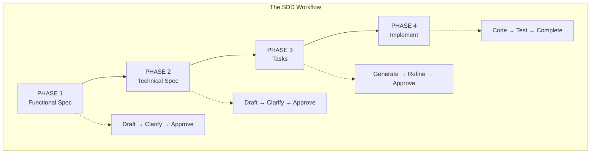
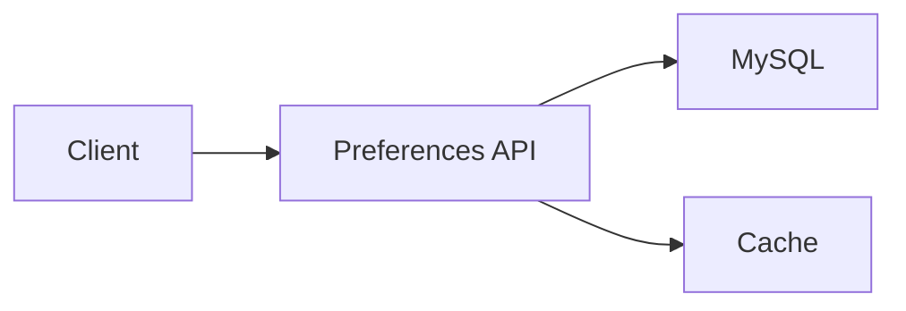

# SDD Kit Tutorial

**Welcome to SDD Kit!** This tutorial will guide you through creating your first feature using Specification-Driven Development.

---

## Table of Contents

1. [What is SDD Kit?](#what-is-sdd-kit)
2. [Prerequisites](#prerequisites)
3. [Quick Start](#quick-start)
4. [Complete Walkthrough](#complete-walkthrough)
5. [Common Patterns](#common-patterns)
6. [Troubleshooting](#troubleshooting)
7. [FAQ](#faq)

---

## What is SDD Kit?

SDD Kit is a **Specification-Driven Development** framework that helps you:



### Key Benefits

| Benefit | Description |
|---------|-------------|
| **Predictability** | Know what you're building before coding |
| **Quality** | Mandatory tests and validations |
| **Collaboration** | AI assists, humans decide |
| **Documentation** | Always up-to-date specs |
| **project Platform compliance** | Built-in your platform support |
| **Elegance** | Minimal specs, maximum clarity |

### The Elegance Principle

> **Specs should be as small and elegant as possible** - containing only what's necessary for Platform AI docs agents and humans to succeed.

| Phase | Target Size | Focus On |
|-------|-------------|----------|
| Functional Spec | 1-2 pages | Outcomes, edge cases Platform AI docs won't infer |
| Technical Spec | 2-3 pages | Architecture decisions, API contracts |
| Tasks | 0.5 page | Clear deliverables, dependencies |

📖 **Full guide**: [standards/elegance-principle.md](./standards/elegance-principle.md)

---

## Prerequisites

### Required

- [ ] Claude Code or compatible Platform AI docs assistant
- [ ] Git repository initialized
- [ ] Basic understanding of your project's tech stack

### For your team Teams

- [ ]  access configured (optional but recommended)
- [ ] code review tool configured (optional)
- [ ] E2E test framework configured (optional - for E2E test generation)

### Setup Check

```bash
# Verify SDD Kit is present
ls -la .development-agents/

# Expected output:
# skills/
# templates/
# validators/
# standards/
# WORKFLOW.md
# standards/governance.md
# ...
```

---

## Quick Start

### Step 1: Initialize a Feature

```
/sdd.start user-authentication
```

This creates:
```
sdd/wip/user-authentication/
├── 1-functional/
│   └── spec.md (empty template)
├── 2-technical/
│   └── spec.md (empty template)
├── 3-tasks/
│   └── tasks.json (generated by /sdd.plan)
├── 4-implementation/
│   └── progress.md (empty template)
└── meta.md (feature metadata)
```

### Step 2: Draft Functional Spec

```
/sdd.spec
```

> **Note**: The framework automatically detects the active feature from `sdd/wip/`. No need to specify the feature name.

The Platform AI docs will interview you about:
- What problem are you solving?
- Who are the users?
- What are the acceptance criteria?

### Step 3: Complete the Workflow

```
/sdd.spec functional --approve
/sdd.spec
/sdd.spec technical --approve
/sdd.plan
/sdd.plan --approve
/sdd.build
/sdd.finish
```

> **Note**: All commands detect the active feature automatically. Only `/sdd.start` requires the feature name.

**That's it!** Your feature is now implemented with full documentation.

---

## Complete Walkthrough

Let's build a real feature: **User Preferences API**

### Phase 1: Functional Specification

> 💡 **Keep it elegant**: Focus on outcomes and edge cases Platform AI docs won't infer. Target: 1-2 pages.

#### 1.1 Initialize

```
/sdd.start user-preferences
```

#### 1.2 Draft Functional Spec

```
/sdd.spec
```

> The framework detects `user-preferences` as the active feature from `sdd/wip/`.

**AI Interview Example:**

```
AI: What problem does this feature solve?

You: Users can't customize their experience. They want to set
     preferences like notification settings, language, and timezone.

AI: Who are the target users?

You: All registered users of our platform.

AI: What are the key user stories?

You:
- As a user, I want to set my notification preferences
- As a user, I want to change my language
- As a user, I want to set my timezone
- As a user, I want my preferences to persist across sessions

AI: What are the success metrics?

You:
- 80% of users set at least one preference
- Preference changes take effect within 1 second
- 99.9% availability
```

**Generated Functional Spec** (simplified):

```markdown
# User Preferences - Functional Specification

## Problem Statement
Users cannot customize their experience on the platform.

## User Stories
1. US-001: Set notification preferences
2. US-002: Change language preference
3. US-003: Set timezone
4. US-004: Persist preferences across sessions

## Acceptance Criteria
- AC-001: User can enable/disable email notifications
- AC-002: User can select from 5 supported languages
- AC-003: User can select timezone from standard list
- AC-004: Preferences load on login within 100ms

## Success Metrics
- 80% preference adoption rate
- < 1s preference update time
- 99.9% API availability
```

#### 1.3 Clarify (if needed)

```
/sdd.spec functional --include
```

Use this if you have questions or want to add details.

#### 1.4 Approve

```
/sdd.spec functional --approve
```

This runs validation and marks Phase 1 complete.

---

### Phase 2: Technical Specification

> 💡 **Keep it elegant**: Focus on architecture decisions and API contracts. Skip implementation details Platform AI docs will figure out. Target: 2-3 pages.

#### 2.1 Draft Technical Spec

```
/sdd.spec
```

**AI Interview Example:**

```
AI: What technology stack will you use?

You: Node.js with Express,  MySQL for storage,  Cache for caching.

AI: What API design approach?

You: REST API with JSON responses.

AI: What project services will you integrate?

You:  IAM for authentication,  DataStore consideration.

AI: What are the performance requirements?

You: P95 latency < 100ms, handle 1000 RPS.
```

**Generated Technical Spec** (simplified):

```markdown
# User Preferences - Technical Specification

## Architecture



## API Endpoints

### GET /api/v1/users/{userId}/preferences
- Returns user preferences
- Cached for 5 minutes
- P95: < 50ms

### PUT /api/v1/users/{userId}/preferences
- Updates preferences
- Invalidates cache
- P95: < 100ms

## Data Model

```sql
CREATE TABLE user_preferences (
  user_id VARCHAR(36) PRIMARY KEY,
  notifications_enabled BOOLEAN DEFAULT true,
  language VARCHAR(5) DEFAULT 'en',
  timezone VARCHAR(50) DEFAULT 'UTC',
  updated_at TIMESTAMP
);
```

## Integration
- IAM/SSO: Authentication via JWT
- Metrics: Performance monitoring
```

#### 2.2 Approve Technical Spec

```
/sdd.spec technical --approve
```

---

### Phase 3: Task Generation

#### 3.1 Generate Tasks

```
/sdd.plan
```

**Generated Tasks** (simplified):

```markdown
## Tasks

### TASK-001: Database Setup
- Create migration for user_preferences table
- Complexity: Low
- Tests: Migration rollback test

### TASK-002: Preferences Service
- Implement PreferencesService class
- Methods: get, update, delete
- Complexity: Medium
- Tests: Unit tests for all methods

### TASK-003: API Endpoints
- GET /api/v1/users/{userId}/preferences
- PUT /api/v1/users/{userId}/preferences
- Complexity: Medium
- Tests: Integration tests

### TASK-004: Caching Layer
- Implement  Cache
- Cache invalidation on update
- Complexity: Low
- Tests: Cache hit/miss tests

### AUTO-TASK-001:  Compliance
- Dockerfile and Dockerfile.runtime
- /ping endpoint
- Complexity: Low

### AUTO-TASK-002: Unit Tests
- 80% coverage minimum
- Complexity: Medium

### AUTO-TASK-003: Integration Tests
- API endpoint tests
- Complexity: Low

### AUTO-TASK-E2E: Generate E2E Tests with E2E test framework
> Auto-generated when functional spec contains E2E scenarios

- Uses E2E test framework tools (analyze_backend, generate_bdd_tests)
- Generates Cucumber/Gherkin feature files
- Playwright step definitions
- Complexity: Low
```

#### 3.2 Refine Tasks (optional)

```
/sdd.plan --refine
```

Adjust estimates, add details, or split tasks.

#### 3.3 Approve Tasks

```
/sdd.plan --approve
```

---

### Phase 4: Implementation

#### 4.1 Implement All Tasks

```
/sdd.build
```

The Platform AI docs will:
1. Execute tasks in dependency order
2. Write code according to specs
3. Run tests after each task
4. Update progress.md

**Progress Output:**

```
━━━━━━━━━━━━━━━━━━━━━━━━━━━━━━━━━━━━━━━━━━
📋 TASK-001: Database Setup
━━━━━━━━━━━━━━━━━━━━━━━━━━━━━━━━━━━━━━━━━━

Creating migration...
✅ Created: migrations/001_create_user_preferences.sql

Running migration test...
✅ Migration up: SUCCESS
✅ Migration down: SUCCESS

━━━━━━━━━━━━━━━━━━━━━━━━━━━━━━━━━━━━━━━━━━
📋 TASK-002: Preferences Service
━━━━━━━━━━━━━━━━━━━━━━━━━━━━━━━━━━━━━━━━━━

Creating service...
✅ Created: src/services/PreferencesService.ts

Running unit tests...
✅ 12 tests passed

[... continues for all tasks ...]

━━━━━━━━━━━━━━━━━━━━━━━━━━━━━━━━━━━━━━━━━━
✅ IMPLEMENTATION COMPLETE
━━━━━━━━━━━━━━━━━━━━━━━━━━━━━━━━━━━━━━━━━━

Tasks: 7/7 completed
Tests: 45 passed, 0 failed
Coverage: 87%
```

#### 4.2 Complete Feature

```
/sdd.finish
```

This runs final validations:
- ✅ All tasks completed
- ✅ Tests passing
- ✅ Coverage > 80%
- ✅ code compliance validated
- ✅ Specs up-to-date

**On success**, feature moves to `sdd/features/user-preferences/`.

---

## Common Patterns

### Pattern 1: Clarify Before Proceeding

When unsure about requirements:

```
/sdd.spec functional --include

You: I'm not sure if we need to support multiple languages
     or just English for now.

AI: Let me help clarify. What markets will this feature serve?

You: Initially just Brazil, but we plan to expand to Mexico
     and Argentina.

AI: Recommended approach: Start with Portuguese and Spanish
    support (3 languages). Should I update the spec?

You: Yes, please update.
```

### Pattern 2: Check Status Anytime

```
/sdd.check

Output:
━━━━━━━━━━━━━━━━━━━━━━━━━━━━━━━━━━━━━━━━━━
📊 Feature: user-preferences
━━━━━━━━━━━━━━━━━━━━━━━━━━━━━━━━━━━━━━━━━━

Phase: Implementation (4/4)
Progress: 5/7 tasks completed (71%)

Completed:
  ✅ TASK-001: Database Setup
  ✅ TASK-002: Preferences Service
  ✅ TASK-003: API Endpoints
  ✅ TASK-004: Caching Layer
  ✅ AUTO-TASK-001:  Compliance

In Progress:
  🔄 AUTO-TASK-002: Unit Tests

Pending:
  ⏳ AUTO-TASK-003: Integration Tests

Test Coverage: 72% (target: 80%)
```

### Pattern 3: Implement Specific Task

Instead of all tasks:

```
/sdd.build task TASK-003
```

### Pattern 4: Brownfield Mode

For existing projects:

```
/sdd.start user-preferences --mode=brownfield

# Same structure as greenfield, but:
# - meta.md includes brownfield context (affected specs, impact)
# - Specs describe CHANGES to the existing system
# - /sdd.finish offers to merge back to system specs
```

---

## Troubleshooting

### Issue: Validation Fails

```
❌ Functional spec validation failed

Errors:
- Missing acceptance criteria for US-003
- Ambiguous term: "fast response time"
```

**Solution**:
```
/sdd.spec functional --include

# Add missing acceptance criteria
# Replace "fast" with specific metric (e.g., "< 100ms")
```

### Issue: Tests Failing

```
❌ Test validation failed
   Coverage: 65% (required: 80%)
```

**Solution**:
```
# Add more tests
/sdd.build task AUTO-TASK-002

# Or check which code needs coverage
npm test -- --coverage
```

### Issue:  Compliance Fails

```
❌ code compliance validation failed
   Missing: Dockerfile.runtime
   Missing: /ping endpoint
```

**Solution**:
```
# Implement code compliance task
/sdd.build task AUTO-TASK-001
```

### Issue: Stuck in Phase

```
# Check what's blocking
/sdd.check --sync

# See detailed errors and fix them
```

---

## FAQ

### Q: Can I skip phases?

**No.** The framework enforces phase progression. Each phase must be validated before proceeding.

### Q: What if requirements change mid-implementation?

Update the spec first:
```
/sdd.spec functional --include
# Make changes
/sdd.check --sync
```

### Q: Can I work on multiple features?

**Yes.** Each feature has its own folder in `sdd/wip/`.

```
/sdd.list

Features in progress:
- user-preferences (Phase 4, 71%)
- payment-integration (Phase 2, 40%)
- search-optimization (Phase 1, 20%)
```

### Q: How do I cancel a feature?

```
/sdd.cancel "Priorities changed"
```

Feature moves to `sdd/cancelled/` with full history preserved.

### Q: What's the difference between greenfield and brownfield?

| Mode | Use When | Difference |
|------|----------|------------|
| Greenfield | New feature from scratch | Specs describe new functionality |
| Brownfield | Modifying existing system | Specs describe changes, meta.md tracks affected system specs |

### Q: Do I need ProjectSystemMCP (or an equivalent internal service-discovery MCP)?

**Recommended but not required.** It helps discover existing project services automatically. Without it, manually document project service integrations.

### Q: What is E2E test framework?

**Optional MCP for E2E test generation.** E2E test framework (Large Testing Platform) can automatically generate Cucumber/Gherkin tests from your E2E scenarios. If not configured, the framework continues with template files that require manual completion.

### Q: How many tokens does a typical feature consume?

| Feature Size | Phases 1-3 | Phase 4 | Total |
|--------------|------------|---------|-------|
| Small (1-3 tasks) | ~30K-50K tokens | ~50K-80K tokens | ~80K-130K tokens |
| Medium (4-8 tasks) | ~50K-80K tokens | ~80K-150K tokens | ~130K-230K tokens |
| Large (9+ tasks) | ~80K-120K tokens | ~150K-300K tokens | ~230K-420K tokens |

---

## Next Steps

1. **Try it yourself**: Initialize a small feature
2. **Read the workflow**: `.development-agents/WORKFLOW.md`
3. **Master spec elegance**: `~/.development-agents/standards/elegance-principle.md`
4. **Understand principles**: `~/.development-agents/standards/governance.md`
5. **Explore commands**: `.development-agents/COMMANDS.md`

### Command Quick Reference

```
# Lifecycle
/sdd.start "feature-name"             # Start new feature (requires name)
/sdd.check                            # Check progress (auto-detects feature)
/sdd.list                             # List all features
/sdd.cancel "reason"                  # Cancel feature

# Phase 1: Functional
/sdd.spec                             # Draft functional spec
/sdd.spec functional --include        # Clarify functional spec
/sdd.spec functional --approve        # Approve functional spec

# Phase 2: Technical
/sdd.spec                             # Draft technical spec (after functional approved)
/sdd.spec technical --include         # Clarify technical spec
/sdd.spec technical --approve         # Approve technical spec

# Phase 3: Tasks
/sdd.plan                             # Generate tasks
/sdd.plan --refine                    # Refine tasks
/sdd.plan --approve                   # Approve tasks

# Phase 4: Implementation
/sdd.build                            # Build all tasks
/sdd.build task TASK-XXX              # Build specific task
/sdd.finish                           # Finish feature

# Utilities
/sdd.check --sync                     # Check layer consistency
/sdd.check --compliance               # Check /test compliance
```

> **Note**: All commands auto-detect the active feature from `sdd/wip/`. Only `/sdd.start` requires the feature name.

---

**Happy building with SDD Kit!** 🚀
