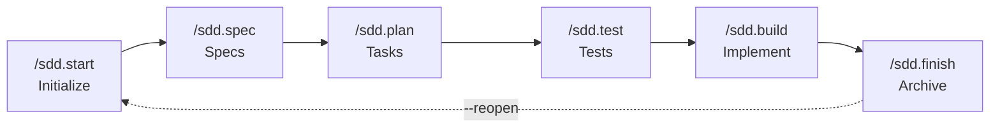
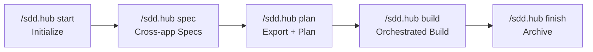

# SDD Kit: Workflow Guide

**Version**: 1.7.2
**Last Updated**: 2026-05-07

---

## Overview

SDD Kit follows a **four-phase workflow** with flexible execution modes. This document describes the complete workflow from feature initialization to completion.

### Execution Modes

| Mode | Commands | Best For |
|------|----------|----------|
| **Express** | `/sdd.go` (1 command) | Simple features, quick prototypes |
| **Standard** | 4-5 commands | Most features, balanced control **(DEFAULT)** |

> **Default**: `/sdd.start "feature"` without flags uses Standard mode.

### Project Modes

| Mode | Detected By | Description |
|------|-------------|-------------|
| **Greenfield** | (default) | Building new features from scratch |
| **Brownfield** | `sdd/specs/` exists | Modifying existing documented systems |
| **Reverse Engineering** | `/sdd.reverse-eng` | Documenting existing codebases |

---

## Express Workflow (1 Command)

For simple features with clear requirements:

```bash
/sdd.go "add password reset with email verification"
```

**What happens**:
1. AI asks 3-5 critical questions
2. Auto-generates functional + technical specs
3. Auto-generates and approves tasks
4. Implements all tasks
5. Validates and archives

**Token Budget**: ~80K-100K tokens

**Best for**: Simple features, prototypes, OpenSpec migration

---

## Standard Workflow (4-5 Commands)

For most features, balanced control and quality:



### Phase 0: Initialize

**Command**: `/sdd.start "feature-name"`

**What happens**:
- **Assigns date prefix** (YYYYMMDD) to the feature directory
- **Creates feature branch** `feature/<name>` from master/main
- Creates folder structure in `sdd/wip/[YYYYMMDD-feature-name]/`
- Sets execution mode (standard by default)
- Detects greenfield/brownfield mode
- Creates meta.md and spec templates

**Output**: Feature ready for specifications (e.g., `sdd/wip/20260120-user-auth/`)

**Next**: `/sdd.spec`

---

### Phase 1-2: Specifications

**Command**: `/sdd.spec`

**What happens**:

**Functional Spec** (WHAT to build):
- AI interviews about problem, objectives
- Builds user stories with acceptance criteria
- Defines success metrics
- Asks: "Ready to approve functional spec?" [Y/n]

**Technical Spec** (HOW to build):
- AI loads functional spec
- Interviews about architecture
- Queries your internal service directory/registry for project services, if one exists
- Documents APIs, data model, testing
- Asks: "Ready to approve technical spec?" [Y/n]

**Complexity**: Low-Medium (varies by spec size)

**Output**: Both specs validated and approved

**Next**: `/sdd.plan`

---

### Phase 3: Task Planning

**Command**: `/sdd.plan`

**What happens**:
- AI analyzes specs
- Generates 15-30 granular tasks
- Creates dependency graph
- Shows task summary
- Asks: "Adjust any tasks?" [Y/n]
- Proposes execution strategies:
  - Sequential (~80K tokens)
  - Batched (~100K tokens) - recommended
  - Parallel (~140K tokens)
- User chooses strategy

**Token Budget**: ~100K tokens (batched strategy)

**Output**: Tasks approved with execution strategy

**Next**: `/sdd.test`

---

### Phase 3.5: Tests-First (Gate 2.5)

**Command**: `/sdd.test`

**What happens**:
- AI reads functional + technical specs and approved tasks
- Writes unit/integration tests from acceptance criteria and edge cases
- Verifies **red phase** — new tests fail before any feature implementation
- Human approves test plan and test files
- Skipped automatically for `prototype` project type

**Token Budget**: ~40K-60K tokens

**Output**: `sdd/wip/[feature]/4-tests/` with approved, failing tests

**Next**: `/sdd.build`

---

### Phase 4: Implementation

**Command**: `/sdd.build`

**What happens**:
- Reads execution strategy
- Implements tasks in order/parallel — **does not write new unit/integration tests**
- Runs approved tests after each task until green
- Creates commits
- Reports progress
- Pauses on errors, offers options

**Complexity**: High (depends on feature size and task count)

**Output**: All tasks implemented, tested, committed

**Next**: `/sdd.finish`

---

### Completion

**Command**: `/sdd.finish`

**What happens**:
- Runs all validators:
  - Task completion check
  - code compliance (MANDATORY)
  - Test validation (MANDATORY)
  - Code quality
- Generates summary documentation
- Archives to `sdd/features/`
- Shows final metrics

**Output**: Feature archived with documentation

---

## Granular Control (Optional Flags)

For finer control within Standard mode:

```bash
/sdd.start "complex-feature"

# Separate spec phases
/sdd.spec functional
/sdd.spec functional --approve
/sdd.spec technical
/sdd.spec technical --approve

# Explicit plan refinement
/sdd.plan --refine
/sdd.plan --approve
/sdd.test
/sdd.test --approve

# Targeted implementation
/sdd.build task TASK-001
/sdd.build phase 2
```

---

## Workflow Comparison

| Aspect | Express | Standard |
|--------|---------|----------|
| Commands | 1 | 5-6 |
| Interaction | Low | Medium |
| Control | Minimal | Balanced |
| Questions | 3-5 critical | Full interview |
| Confirmations | None | At key points |
| Best for | Simple features | Most features |

---

## Hub Workflow (Multi-app)

For teams working with ecosystems of multiple  apps that collaborate in a domain.

### Execution modes

| Mode | Command | Best for |
|------|---------|----------|
| **Express** | `/sdd.hub go "description"` | Simple cross-app features, clear requirements |
| **Standard** | 6 separate sub-commands | Most features, balanced control |

### Standard flow



### Express flow

```bash
/sdd.hub go "campaign v2 with new budget rules"
# 3-5 questions → auto start → auto spec → auto plan → auto build → auto finish
```

### What is a hub

A **hub** is a central repo that coordinates specs, planning, and implementation across multiple apps. The hub has its own `sdd/` for cross-app decisions. Each member app has its standard `sdd/`.

**Detection**: A directory is a hub when `sdd/PROJECT.md` contains a `## Hub members` table.

### Hub flow

| Step | Command | What happens |
|------|---------|--------------|
| 1 | `/sdd.hub start` | Select target members, create hub feature |
| 2 | `/sdd.hub spec functional` | Cross-app functional spec |
| 3 | `/sdd.hub spec technical` | Tech spec with `## {app}` scope sections |
| 4 | `/sdd.hub plan` | Export child specs to apps, run `/sdd.plan` per app |
| 5 | `/sdd.hub build` | Orchestrate `/sdd.build` per app (respects dependency layers) |
| 6 | `/sdd.hub finish` | Archive hub and all child specs |

### Child spec export

During `/sdd.hub plan`, the hub tech spec sections are exported as child spec stubs into each app's `sdd/wip/{feature}/`. These are standard kit specs — running `cd app && /sdd.build` works normally.

### Coordination manifest

The hub generates a `tasks.json` with `"type": "coordination"` that defines dependency layers between apps. Build respects these layers (parallel within a layer, sequential across layers).

### Utility commands

| Command | Purpose |
|---------|---------|
| `/sdd.hub check` | Drift detection, per-app status |
| `/sdd.hub sync` | Verify git status of member repos |
| `/sdd.hub list` | Tree display with features |
| `/sdd.hub cancel` | Cancel and clean up |

### Compatibility

- Existing app-level commands are not modified
- `/sdd.go` detects hubs and redirects to `/sdd.hub`
- Hub hooks available via `/sdd.skill connect --phases hub-*`

---

## Post-Completion Iteration

After `/sdd.finish`, you may need to iterate on a completed feature. Use `--reopen` to bring it back to WIP:

```bash
/sdd.start --reopen 003               # Reopen feature 003 (asks target phase)
/sdd.start --reopen user-auth --phase 2  # Reopen directly to technical spec
```

**What happens**:
1. Validates feature exists in `sdd/features/`
2. Checks for reverse dependencies (features that override/extend/deprecate this one)
3. Asks target phase (or uses `--phase` flag)
4. Moves `sdd/features/[name]` → `sdd/wip/[name]`
5. Updates `meta.md` with reopened state
6. Switches to feature branch (or creates `feature/name-reopen`)

**Gate**: If any other feature references this one via `<!-- overrides/extends/deprecates: -->` annotations, reopen is **blocked**. Create a new feature instead.

**After reopen**: The feature is a normal WIP feature. Use `/sdd.spec`, `/sdd.plan`, `/sdd.build`, and `/sdd.finish` as usual.

---

## Utility Commands

Available at any point in the workflow:

| Command | Purpose |
|---------|---------|
| `/sdd.check` | View status, progress, metrics |
| `/sdd.check --sync` | Verify layer consistency + propose fixes |
| `/sdd.check --compliance` | Verify /tests/lint + propose fixes |
| `/sdd.check --resume` | List all resumable sessions |
| `/sdd.list` | List all features |
| `/sdd.backlog` | Manage backlog (TODOs, Debt, Ideas) |
| `/sdd.rollback` | Revert to previous phase |
| `/sdd.rollback --task` | Revert specific task |
| `/sdd.cancel` | Cancel feature |
| `/sdd.fix` | Fix errors with horizontal consistency |

---

## Brownfield Workflow

When modifying existing systems with documented specs:

**Detection**: Automatic if `sdd/specs/` exists

**Same structure as greenfield** - the specs themselves ARE the delta:
```
sdd/wip/[feature]/
├── 1-functional/spec.md     # NEW requirements (delta)
├── 2-technical/spec.md      # HOW to implement changes (delta)
├── 3-tasks/tasks.json
├── 4-implementation/progress.md
└── meta.md                  # Contains: affected_specs, impact assessment
```

**Differences from greenfield**:
| Phase | Greenfield | Brownfield |
|-------|------------|------------|
| `/sdd.start` | Creates structure | + Records affected system specs in meta.md |
| `/sdd.spec` | Design freely | Specs describe CHANGES to existing system |
| `/sdd.build` | Implement | Respect existing patterns |
| `/sdd.finish` | Archive | Archive + update `sdd/specs/` |

**Key principle**: In brownfield, your functional and technical specs describe what's NEW or CHANGED. They are inherently delta documentation.

---

## Reverse Engineering Workflow

For undocumented existing codebases:

```bash
# Full system documentation (4 phases)
/sdd.reverse-eng
# Creates:
#   - sdd/extracted/raw/                    (Phase 1: Extraction)
#   - sdd/extracted/DOCUMENTATION_GAPS.md   (Phase 2: Basic coverage)
#   - sdd/extracted/DISCREPANCIES_REPORT.md (Phase 2.5: Field-level validation)
#   - sdd/extracted/functional-spec.md      (Phase 3: Synthesized with confidence)
#   - sdd/extracted/technical-spec.md       (Phase 3: Synthesized with confidence)
```

### Reverse Engineering Phases

| Phase | Name | Output |
|-------|------|--------|
| 1 | Extraction | `raw/` folder with  + code data |
| 2 | Basic Cross-Validation | `DOCUMENTATION_GAPS.md` with coverage % |
| 2.5 | Deep Cross-Validation | `DISCREPANCIES_REPORT.md` with field-level diffs |
| 3 | Synthesis | Specs with 5-level confidence (VERIFIED/PARTIAL/CODE_ONLY/DOCS_ONLY/UNKNOWN) |

After reverse engineering, use standard workflow:
```bash
/sdd.start "new-feature"    # Brownfield mode auto-enabled
/sdd.spec
...
```

---

## Quality Gates

Each phase has validation requirements:

| Phase | Validation | Blocking |
|-------|------------|----------|
| Functional | User stories, acceptance criteria, metrics | Yes |
| Technical | Architecture, APIs, data model, testing | Yes |
| Tasks | Estimations, criteria, dependencies | Yes |
| Completion | Tests passing, code compliance | Yes |

**Validators**:
```bash
.development-agents/tools/validation/validate-functional.sh
.development-agents/tools/validation/validate-technical.sh
.development-agents/tools/validation/validate-tasks.sh
.development-agents/tools/validation/validate-code.sh
.development-agents/tools/validation/validate-tests.sh
```

---

## Mandatory Requirements

Every feature MUST have:

- ✅ Functional spec with user stories + acceptance criteria
- ✅ Technical spec with API contracts + data model
- ✅ Tests (80% coverage minimum)
- ✅ code compliance (Dockerfile, Dockerfile.runtime, /ping)

---

## Feature Naming

Features are automatically assigned a date prefix (YYYYMMDD) when created:

```
sdd/
├── wip/
│   ├── 20260120-user-auth/       # Created Jan 20
│   ├── 20260203-payment/         # Created Feb 3
│   └── 20260325-notifications/   # Created Mar 25
└── features/
    ├── 20250101-initial-setup/   # First feature (completed)
    └── 20250115-api-versioning/  # Second feature (completed)
```

### Naming Rules

| Rule | Description |
|------|-------------|
| **Format** | Date prefix with hyphen: `YYYYMMDD-feature-name` |
| **Organizational** | Date is for chronological ordering only, NOT an identifier |
| **Permanent** | Date prefix never changes when moving between directories |
| **No shared state** | No counter file needed — date comes from system clock |

### Feature Reference

Features are identified by name (the date prefix is NOT an identifier):
- **Name**: `/sdd.check user-auth`
- **Full name**: `/sdd.check 20260120-user-auth`

### Migration

When `/sdd.list` detects features without date prefix, it automatically migrates them:

```
⚠️  Features without date prefix detected. Migrating automatically...

Migrating features:
  001-user-auth → 20250101-user-auth
  002-payment   → 20250103-payment
  dark-mode     → 20250105-dark-mode

✅ 3 features migrated.
```

---

## Directory Structure

```
sdd/
├── backlog.md                    # Centralized backlog (TODOs, Debt, Ideas)
├── wip/                          # Work in progress
│   └── [YYYYMMDD-feature-name]/  #: With date prefix
│       ├── 1-functional/spec.md
│       ├── 2-technical/
│       │   ├── spec.md
│       │   └── architecture.md
│       ├── 3-tasks/tasks.json
│       ├── 4-implementation/
│       │   ├── progress.md
│       │   └── artifacts/
│       └── meta.md               # Includes brownfield context if applicable
│
├── features/                     # Completed features
│   └── [YYYYMMDD-feature-name]/  #: With date prefix
│       ├── README.md
│       ├── functional-spec.md
│       ├── technical-spec.md
│       ├── tasks.json
│       └── implementation-summary.md
│
├── cancelled/                    #: Cancelled features
│   └── [YYYYMMDD-feature-name]_YYYYMMDD/
│
├── extracted/                    # Reverse-engineered
│   ├── raw/
│   ├── functional-spec.md
│   └── technical-spec.md
│
└── specs/                        # System specs (brownfield source of truth)
    ├── architecture.md
    ├── api-contracts/
    └── components.md
```

---

## Common Patterns

### Quick Feature
```bash
/sdd.go "add user avatar upload"
```

### Standard Feature
```bash
/sdd.start payment-gateway
/sdd.spec
/sdd.plan
/sdd.build
/sdd.finish
```

### Resume Work
```bash
/sdd.check                # See where you left off
/sdd.build                # Continue
/sdd.build --resume       # Resume interrupted session
/sdd.build --next         # Auto-continue with next task
```

### Need More Control
```bash
/sdd.build task TASK-007  # Specific task
/sdd.build phase 2        # Specific phase
/sdd.spec functional      # Iterate on functional spec separately
```

### Fix Issues
```bash
/sdd.check --validate         # See failures
/sdd.rollback 2               # Go back to technical phase
/sdd.rollback --task TASK-XXX # Revert specific task
/sdd.rollback --phase N       # Revert to phase N
```

---

## See Also

- [COMMANDS.md](./COMMANDS.md) - Full command reference
- [QUICK_REFERENCE.md](./QUICK_REFERENCE.md) - One-page cheat sheet
- [standards/governance.md](./standards/governance.md) - Quality standards
- [MCP_SETUP_GUIDE.md](./MCP_SETUP_GUIDE.md) - MCP configuration
