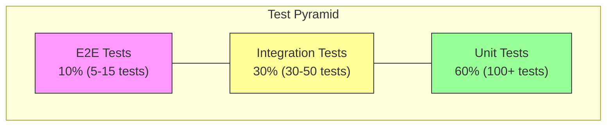

# Testing Strategy Guidelines

**Purpose**: Best practices for test coverage, test pyramid, and testing patterns in SDD Kit projects.

---

## Table of Contents

1. [Test Pyramid](#test-pyramid)
2. [Coverage Requirements](#coverage-requirements)
3. [Testing Patterns by Layer](#testing-patterns-by-layer)
4. [Test Types](#test-types)
5. [Performance Testing](#performance-testing)
6. [Security Testing](#security-testing)
7. [Test Organization](#test-organization)
8. [CI/CD Integration](#cicd-integration)

---

## Test Pyramid

### Recommended Distribution



### Rationale

| Level | % | Speed | Reliability | Coverage |
|-------|---|-------|-------------|----------|
| Unit | 60% | Fast (ms) | High | Code logic |
| Integration | 30% | Medium (s) | Medium | Component interaction |
| E2E | 10% | Slow (min) | Lower | User flows |

### Anti-Patterns to Avoid

```
❌ Ice Cream Cone (Inverted Pyramid)
   Too many E2E, few unit tests
   Result: Slow CI, flaky tests

❌ Hourglass
   Many unit + E2E, few integration
   Result: Integration bugs in production

❌ Rectangle
   Equal distribution
   Result: Inefficient, slow feedback

❌ Separate Schemas for Test/Prod
   Different queries or database schemas for tests vs production
   Result: Tests don't validate production code, schema drift
```

**IMPORTANT**: Use the same queries and schemas in tests and production. **The only difference should be the connection string.**

| Pattern | Status | Why |
|---------|--------|-----|
| Same query, different DB | ✅ Correct | Tests validate real production behavior |
| Different query per env | ❌ Wrong | Tests don't validate prod code |
| Test-only tables/columns | ❌ Wrong | Schema drift, false confidence |

**Example**:

```go
// ✅ CORRECT: Same query everywhere
func (r *UserRepo) GetByID(ctx context.Context, id string) (*User, error) {
    return r.db.QueryRow("SELECT * FROM users WHERE id = ?", id)
}
// Tests use the same function, just point to different DB (H2, test MySQL, prod MySQL)

// ❌ WRONG: Different queries
// Production: SELECT id, name, email FROM users WHERE id = ?
// Tests: SELECT id, name FROM test_users WHERE id = ?
```

---

## Coverage Requirements

### Minimum Thresholds

| Metric | Minimum | Target | Critical Path |
|--------|---------|--------|---------------|
| Line Coverage | 80% | 90% | 95% |
| Branch Coverage | 75% | 85% | 90% |
| Function Coverage | 85% | 95% | 100% |

### Coverage by Module Type

```
┌─────────────────────────┬─────────┬─────────┐
│ Module Type             │ Minimum │ Target  │
├─────────────────────────┼─────────┼─────────┤
│ Business Logic/Domain   │ 90%     │ 95%     │
│ API Endpoints           │ 85%     │ 90%     │
│ Data Access Layer       │ 80%     │ 90%     │
│ Utilities               │ 90%     │ 95%     │
│ UI Components           │ 70%     │ 80%     │
│ Configuration           │ 60%     │ 70%     │
│ Generated Code          │ N/A     │ Exclude │
└─────────────────────────┴─────────┴─────────┘
```

### What to Exclude from Coverage

```javascript
// Coverage configuration example (Jest)
coveragePathIgnorePatterns: [
  '/node_modules/',
  '/dist/',
  '/__generated__/',
  '/*.config.js',
  '/migrations/',
  '/__mocks__/'
]
```

---

## Testing Patterns by Layer

### Domain/Business Logic

**Pattern**: Pure unit tests with no mocks

```typescript
// ✅ Good: Testing pure domain logic
describe('Order', () => {
  describe('calculateTotal', () => {
    it('should sum item prices', () => {
      const order = new Order([
        { price: 100, quantity: 2 },
        { price: 50, quantity: 1 }
      ]);

      expect(order.calculateTotal()).toBe(250);
    });

    it('should apply discount correctly', () => {
      const order = new Order([{ price: 100, quantity: 1 }]);
      order.applyDiscount(10); // 10%

      expect(order.calculateTotal()).toBe(90);
    });
  });
});
```

**Test checklist:**
- [ ] All business rules tested
- [ ] Edge cases covered (empty, null, max values)
- [ ] Error conditions tested
- [ ] No external dependencies

### Service Layer

**Pattern**: Unit tests with mocked dependencies

```typescript
// ✅ Good: Testing service with mocked repository
describe('OrderService', () => {
  let orderService: OrderService;
  let mockOrderRepo: jest.Mocked<OrderRepository>;
  let mockPaymentService: jest.Mocked<PaymentService>;

  beforeEach(() => {
    mockOrderRepo = {
      save: jest.fn(),
      findById: jest.fn(),
    };
    mockPaymentService = {
      processPayment: jest.fn(),
    };
    orderService = new OrderService(mockOrderRepo, mockPaymentService);
  });

  it('should create order and process payment', async () => {
    mockPaymentService.processPayment.mockResolvedValue({ success: true });
    mockOrderRepo.save.mockResolvedValue({ id: '123' });

    const result = await orderService.createOrder(orderData);

    expect(mockPaymentService.processPayment).toHaveBeenCalledWith(
      expect.objectContaining({ amount: orderData.total })
    );
    expect(mockOrderRepo.save).toHaveBeenCalled();
    expect(result.id).toBe('123');
  });
});
```

**Test checklist:**
- [ ] Happy path tested
- [ ] Error handling tested
- [ ] Dependencies properly mocked
- [ ] Interactions verified

### API/Controller Layer

**Pattern**: Integration tests with supertest

```typescript
// ✅ Good: Testing API endpoint
describe('POST /api/orders', () => {
  it('should create order and return 201', async () => {
    const response = await request(app)
      .post('/api/orders')
      .set('Authorization', `Bearer ${validToken}`)
      .send({
        items: [{ productId: '123', quantity: 2 }],
        shippingAddress: { ... }
      });

    expect(response.status).toBe(201);
    expect(response.body).toHaveProperty('orderId');
    expect(response.body.status).toBe('created');
  });

  it('should return 400 for invalid input', async () => {
    const response = await request(app)
      .post('/api/orders')
      .set('Authorization', `Bearer ${validToken}`)
      .send({ items: [] }); // Invalid: empty items

    expect(response.status).toBe(400);
    expect(response.body.error).toContain('items');
  });

  it('should return 401 without auth', async () => {
    const response = await request(app)
      .post('/api/orders')
      .send({ items: [{ productId: '123', quantity: 1 }] });

    expect(response.status).toBe(401);
  });
});
```

**Test checklist:**
- [ ] Success response (200/201)
- [ ] Validation errors (400)
- [ ] Authentication errors (401)
- [ ] Authorization errors (403)
- [ ] Not found errors (404)
- [ ] Server errors handled (500)

### Data Access Layer

**Pattern**: Integration tests with test database

```typescript
// ✅ Good: Testing repository with real database
describe('OrderRepository', () => {
  let repository: OrderRepository;
  let testDb: TestDatabase;

  beforeAll(async () => {
    testDb = await TestDatabase.create();
    repository = new OrderRepository(testDb.connection);
  });

  afterAll(async () => {
    await testDb.destroy();
  });

  beforeEach(async () => {
    await testDb.clear('orders');
  });

  it('should save and retrieve order', async () => {
    const order = createTestOrder();

    await repository.save(order);
    const retrieved = await repository.findById(order.id);

    expect(retrieved).toEqual(order);
  });

  it('should return null for non-existent order', async () => {
    const result = await repository.findById('non-existent');

    expect(result).toBeNull();
  });
});
```

**Test checklist:**
- [ ] CRUD operations tested
- [ ] Queries tested with real data
- [ ] Transactions tested
- [ ] Database cleaned between tests

### Frontend Components

**Pattern**: Component tests with React Testing Library

```typescript
// ✅ Good: Testing React component
describe('OrderForm', () => {
  it('should submit form with valid data', async () => {
    const onSubmit = jest.fn();
    render(<OrderForm onSubmit={onSubmit} />);

    // Fill form
    await userEvent.type(
      screen.getByLabelText('Product'),
      'Test Product'
    );
    await userEvent.type(
      screen.getByLabelText('Quantity'),
      '5'
    );

    // Submit
    await userEvent.click(screen.getByRole('button', { name: /submit/i }));

    expect(onSubmit).toHaveBeenCalledWith({
      product: 'Test Product',
      quantity: 5
    });
  });

  it('should show validation error for empty product', async () => {
    render(<OrderForm onSubmit={jest.fn()} />);

    await userEvent.click(screen.getByRole('button', { name: /submit/i }));

    expect(screen.getByText(/product is required/i)).toBeInTheDocument();
  });
});
```

**Test checklist:**
- [ ] Renders correctly
- [ ] User interactions work
- [ ] Form validation works
- [ ] Error states display
- [ ] Loading states display
- [ ] Accessibility (a11y)

---

## Test Types

### Unit Tests

**When to use:**
- Pure functions
- Business logic
- Data transformations
- Utilities

**Characteristics:**
- No I/O
- No network
- No database
- Fast (< 10ms each)

### Integration Tests

**When to use:**
- API endpoints
- Database operations
- External service integration
- Component interactions

**Characteristics:**
- May use test database
- May mock external services
- Medium speed (100ms - 5s)

### E2E Tests

**When to use:**
- Critical user flows
- Smoke tests
- Cross-system validation

**Characteristics:**
- Real browser/client
- Real (test) environment
- Slow (30s - 5min)

**Critical Flows to E2E Test:**

```
✅ Must have E2E:
- User registration/login
- Main business flow (e.g., create order)
- Payment processing
- Critical integrations

❌ Don't E2E:
- Edge cases (use unit tests)
- Error handling (use integration)
- UI variations (use component tests)
```

### E2E Test Generation with E2E test framework

**E2E test framework** (Large Testing Platform) automates E2E test creation using BDD methodology.

#### Prerequisite: E2E Opt-In (v1.1.0)

> **IMPORTANT**: E2E test generation only occurs if user opted in during `/sdd.spec`.

**Condition check during `/sdd.plan`**:
```
1. Read meta.md → Check testing.e2e.enabled field
2. IF testing.e2e.enabled == false → Skip AUTO-TASK-E2E entirely
3. IF testing.e2e.enabled == true → Check for E2E scenarios, generate AUTO-TASK-E2E
```

#### When Available

If E2E test framework is configured AND `testing.e2e.enabled: true`, AUTO-TASK-E2E uses these tools:

| Tool | Description | Output |
|------|-------------|--------|
| `analyze_backend` | Scans project for controllers/endpoints | API structure discovery |
| `generate_bdd_tests` | Creates Cucumber/Gherkin scenarios | `.feature` files |
| `interactive_frontend` | Crawls UI with Playwright | Step definitions |

#### Generated Output Structure

```
tests/e2e/
├── features/
│   ├── E2E-001-user-login.feature
│   ├── E2E-002-order-creation.feature
│   └── E2E-003-payment-flow.feature
├── steps/
│   ├── common.steps.ts
│   ├── authentication.steps.ts
│   └── orders.steps.ts
├── fixtures/
│   └── test-data.ts
└── playwright.config.ts
```

#### Graceful Degradation

If E2E test framework is unavailable:
- Framework continues without blocking
- Template `.feature` files with TODO markers are generated
- Warning logged for manual completion
- `/sdd.finish` validates but doesn't block on missing E2E tests

#### Configuration

Add to `.mcp.json`:
```json
{
  "mcpServers": {
    "E2E test framework": {
      "command": "mcp-remote-proxy",
      "args": ["https://e2e-mcp.example.com/mcp", "--transport", "http"]
    }
  }
}
```

**Access**: Requires `e2e_mcp` (optional) access group.

#### Integration with Framework

1. **During `/sdd.plan`**: If E2E scenarios exist in functional spec, AUTO-TASK-E2E is auto-generated
2. **During `/sdd.build`**: When executing AUTO-TASK-E2E, E2E test framework tools are called
3. **During `/sdd.finish`**: E2E test presence is validated (warning if missing)

See [MCP_SETUP_GUIDE.md](../MCP_SETUP_GUIDE.md#e2e-mcp-setup) for detailed setup instructions.

---

## Performance Testing

### When Required

Performance testing is required when:
- Technical spec defines latency requirements (P95, P99)
- High traffic is expected (> 100 RPS)
- Real-time requirements exist
- Database queries on large datasets

### Load Test Template

```javascript
// k6 load test example
import http from 'k6/http';
import { check, sleep } from 'k6';

export const options = {
  stages: [
    { duration: '1m', target: 50 },   // Ramp up
    { duration: '3m', target: 50 },   // Stay at 50 users
    { duration: '1m', target: 100 },  // Spike to 100
    { duration: '3m', target: 100 },  // Stay at 100
    { duration: '1m', target: 0 },    // Ramp down
  ],
  thresholds: {
    http_req_duration: ['p(95)<500', 'p(99)<1000'], // Response time
    http_req_failed: ['rate<0.01'],                  // Error rate < 1%
  },
};

export default function () {
  const res = http.get('https://api.example.com/orders');

  check(res, {
    'status is 200': (r) => r.status === 200,
    'response time OK': (r) => r.timings.duration < 500,
  });

  sleep(1);
}
```

### Performance Thresholds

| Endpoint Type | P50 | P95 | P99 |
|---------------|-----|-----|-----|
| Read (GET) | < 100ms | < 300ms | < 500ms |
| Write (POST/PUT) | < 200ms | < 500ms | < 1000ms |
| Search/Query | < 300ms | < 800ms | < 1500ms |
| Report/Export | < 1000ms | < 3000ms | < 5000ms |

---

## Security Testing

### Required Security Tests

```typescript
describe('Security Tests', () => {
  describe('Authentication', () => {
    it('should reject requests without auth', async () => {
      const res = await request(app).get('/api/protected');
      expect(res.status).toBe(401);
    });

    it('should reject invalid tokens', async () => {
      const res = await request(app)
        .get('/api/protected')
        .set('Authorization', 'Bearer invalid-token');
      expect(res.status).toBe(401);
    });

    it('should reject expired tokens', async () => {
      const expiredToken = generateExpiredToken();
      const res = await request(app)
        .get('/api/protected')
        .set('Authorization', `Bearer ${expiredToken}`);
      expect(res.status).toBe(401);
    });
  });

  describe('Authorization', () => {
    it('should prevent access to other users resources', async () => {
      const userAToken = generateToken({ userId: 'user-a' });
      const res = await request(app)
        .get('/api/users/user-b/orders')
        .set('Authorization', `Bearer ${userAToken}`);
      expect(res.status).toBe(403);
    });
  });

  describe('Input Validation', () => {
    it('should reject SQL injection attempts', async () => {
      const res = await request(app)
        .get('/api/users')
        .query({ search: "'; DROP TABLE users; --" });
      expect(res.status).toBe(400);
    });

    it('should reject XSS attempts', async () => {
      const res = await request(app)
        .post('/api/comments')
        .send({ text: '<script>alert("xss")</script>' });
      // Should either reject or sanitize
      expect(res.body.text).not.toContain('<script>');
    });
  });
});
```

### Security Test Checklist

- [ ] Authentication bypass attempts
- [ ] Authorization (accessing other users' data)
- [ ] SQL injection
- [ ] XSS (if applicable)
- [ ] CSRF protection
- [ ] Rate limiting
- [ ] File upload validation (if applicable)
- [ ] Sensitive data in responses

---

## Test Organization

### File Structure

```
src/
├── domain/
│   ├── Order.ts
│   └── Order.test.ts          # Co-located unit tests
├── services/
│   ├── OrderService.ts
│   └── OrderService.test.ts   # Co-located unit tests
├── api/
│   ├── routes/
│   │   └── orders.ts
│   └── __tests__/
│       └── orders.integration.test.ts  # Integration tests
└── __tests__/                 # E2E and cross-cutting tests
    ├── e2e/
    │   └── order-flow.e2e.test.ts
    └── security/
        └── auth.security.test.ts
```

### Naming Conventions

```
*.test.ts       - Unit tests
*.integration.test.ts - Integration tests
*.e2e.test.ts   - End-to-end tests
*.security.test.ts - Security tests
*.perf.test.ts  - Performance tests
```

### Test Utilities

```typescript
// test/utils/factories.ts
export const createTestOrder = (overrides = {}) => ({
  id: faker.string.uuid(),
  items: [createTestOrderItem()],
  status: 'pending',
  createdAt: new Date(),
  ...overrides
});

// test/utils/database.ts
export class TestDatabase {
  async clear(table: string) { ... }
  async seed(table: string, data: any[]) { ... }
}

// test/utils/auth.ts
export const generateToken = (payload: TokenPayload) => { ... };
export const generateExpiredToken = () => { ... };
```

---

## CI/CD Integration

### Test Stages

```yaml
# GitHub Actions example
jobs:
  test:
    runs-on: ubuntu-latest
    steps:
      - uses: actions/checkout@v4

      - name: Unit Tests
        run: npm run test:unit
        # Fast feedback, runs on every commit

      - name: Integration Tests
        run: npm run test:integration
        # Runs on every PR

      - name: E2E Tests
        run: npm run test:e2e
        # Runs on PR to main/master

      - name: Coverage Report
        run: npm run test:coverage
        # Upload to coverage service

      - name: Security Tests
        run: npm run test:security
        # Runs on every PR
```

### Pre-commit Checks

```bash
# Run fast unit tests before commit
npm run test:unit -- --bail --findRelatedTests
```

### Coverage Gates

```yaml
# Fail if coverage drops
- name: Check Coverage
  run: |
    COVERAGE=$(npm run test:coverage -- --json | jq '.total.lines.pct')
    if (( $(echo "$COVERAGE < 80" | bc -l) )); then
      echo "Coverage $COVERAGE% is below 80%"
      exit 1
    fi
```

---

## Quick Reference

### Test Commands

```bash
# Run all tests
npm test

# Run unit tests only
npm run test:unit

# Run integration tests
npm run test:integration

# Run E2E tests
npm run test:e2e

# Run with coverage
npm run test:coverage

# Run specific test file
npm test -- OrderService.test.ts

# Run tests matching pattern
npm test -- --grep "should create order"

# Watch mode
npm test -- --watch
```

### Coverage Commands

```bash
# Generate coverage report
npm run test:coverage

# View HTML report
open coverage/lcov-report/index.html

# Check coverage thresholds
npm run test:coverage -- --coverageThreshold='{"global":{"lines":80}}'
```

---

## Checklist for Task Implementation

When implementing a task, ensure:

- [ ] Unit tests for new business logic
- [ ] Integration tests for new API endpoints
- [ ] Tests for error cases
- [ ] Coverage meets threshold (>80%)
- [ ] Tests run in CI
- [ ] No flaky tests introduced
- [ ] Test documentation (if complex)

---

*These guidelines should be adapted to your specific project needs. When in doubt, prioritize fast, reliable tests over comprehensive but slow ones.*
