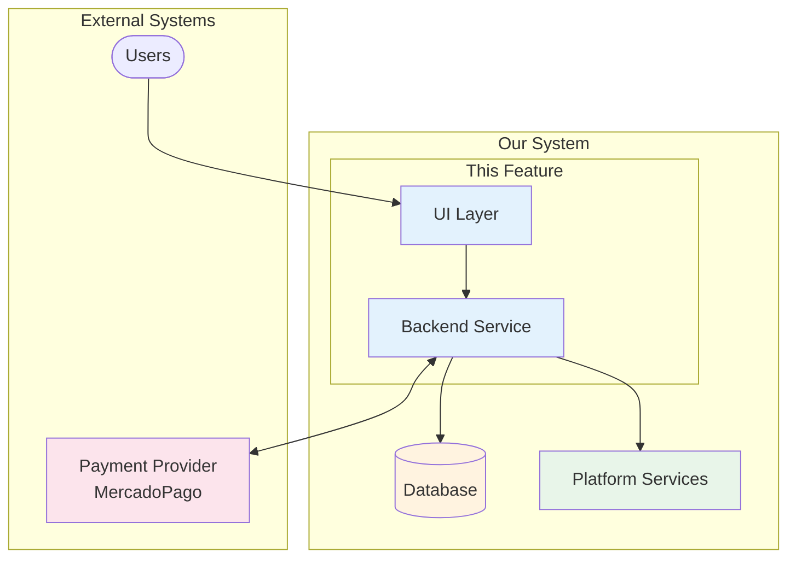
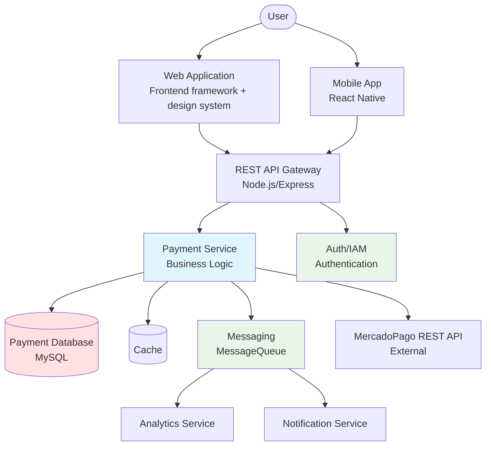
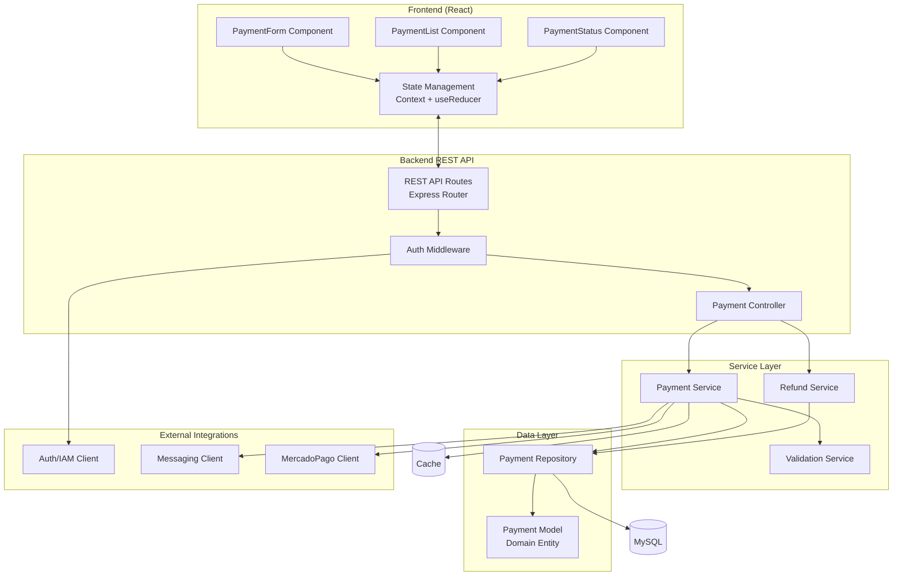
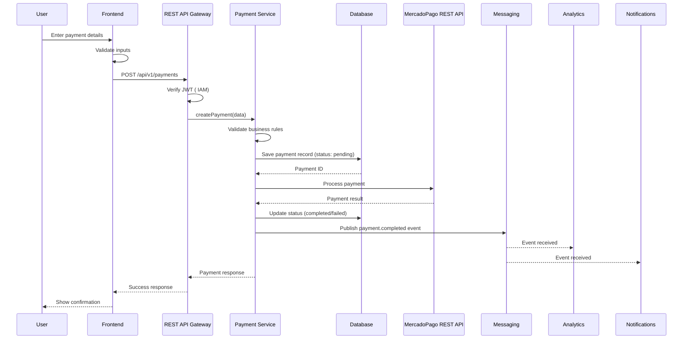
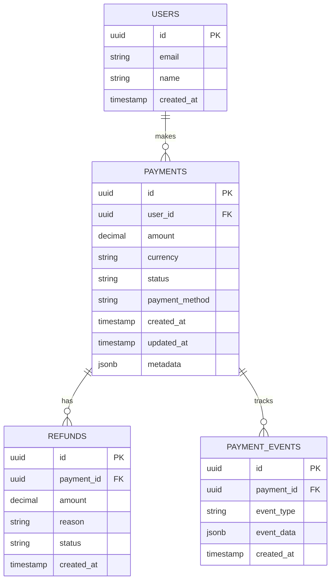
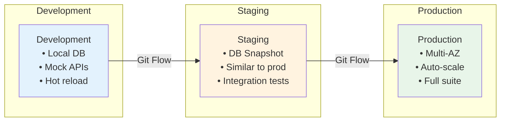
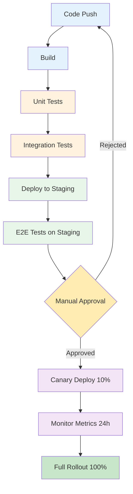

# {{FEATURE_NAME}} - Architecture Diagrams

**Feature**: {{FEATURE_NAME}}
**Created**: {{DATE}}
**Last Updated**: {{DATE}}

---

## System Context Diagram (C4 Level 1)

Shows how this feature fits into the broader system.



---

## Container Diagram (C4 Level 2)

Shows the main containers/applications involved.



---

## Component Diagram (C4 Level 3)

Shows components within the main containers.



---

## Data Flow Diagram

Shows how data moves through the system.



---

## Database Entity-Relationship Diagram



---

## Infrastructure Diagram

Shows deployment architecture.

```mermaid
graph TB
    subgraph "Load Balancer"
        LB[Application Load Balancer]
    end

    subgraph "Application Tier (Auto-scaling)"
        App1[API Instance 1]
        App2[API Instance 2]
        App3[API Instance N]
    end

    subgraph "Data Tier"
        Primary[(Primary DB<br/> MySQL)]
        Replica[(Read Replica)]
         Cache[( Cache Cluster)]
    end

    subgraph "External Services"
        [ Platform<br/>IAM, Messaging, Monitoring]
        MercadoPago[MercadoPago REST API]
    end

    subgraph "Monitoring"
        DD[DataDog<br/>Logs, Metrics, Traces]
    end

    LB --> App1
    LB --> App2
    LB --> App3

    App1 --> Primary
    App2 --> Primary
    App3 --> Replica

    App1 -->  Cache
    App2 -->  Cache
    App3 -->  Cache

    App1 --> 
    App2 --> 
    App3 --> 

    App1 --> MercadoPago
    App2 --> MercadoPago
    App3 --> MercadoPago

    App1 --> DD
    App2 --> DD
    App3 --> DD
    Primary --> DD
     Cache --> DD
```

---

## Technology Stack

### Frontend
- **Framework**: Frontend framework (React) with TypeScript
- **State**: `frontend-framework/store` (8.16.0+) / Context + useReducer (Zustand as fallback)
- **UI Library**: design system Web Design System
- **Testing**: Vitest + React Testing Library

### Backend
- **Runtime**: Node.js 20+
- **Framework**: Express or Fastify
- **Language**: TypeScript
- **ORM**: Prisma or TypeORM

### Data Storage
- **Primary Database**:  MySQL 15+
- **Caching**:  Cache 7+
- **Session Store**:  Cache

### External Services
- **Auth**:  IAM (OAuth2/JWT)
- **Messaging**:  Messaging (MessageQueue)
- **Monitoring**:  DataDog
- **Payments**: MercadoPago REST API

### DevOps
- **Containers**: Docker
- **Orchestration**: Kubernetes
- **CI/CD**: GitHub Actions or GitLab CI
- **IaC**: Terraform

---

## Security Architecture

```mermaid
graph LR
    User[User] -->|HTTPS| CDN[CloudFront CDN]
    CDN --> WAF[Web Application Firewall]
    WAF --> LB[Load Balancer]
    LB --> App[Application<br/>TLS 1.3]

    App -->|Encrypted| DB[(Database<br/>Encrypted at Rest)]
    App -->|mTLS| [Platform Services]
    App -->|TLS| MercadoPago[MercadoPago REST API]

    App --> Vault[Secrets Manager<br/> Vault]
```

**Security Layers**:
1. **Transport**: HTTPS/TLS 1.3 end-to-end
2. **Authentication**:  IAM JWT validation
3. **Authorization**: Role-based access control (RBAC)
4. **Data**: Encryption at rest (AES-256)
5. **Secrets**: Managed via your org's secrets manager/vault (no hardcoded secrets)
6. **WAF**: DDoS protection, SQL injection prevention

---

## Deployment Architecture

### Environments



### Deployment Pipeline



---

## Scalability Considerations

### Horizontal Scaling

- **API**: Stateless, can scale to N instances
- **Database**: Read replicas for read-heavy operations
- **Caching**:  Cache cluster with sharding

### Performance Bottlenecks

| Component | Potential Bottleneck | Mitigation |
|-----------|---------------------|------------|
| Database writes | High payment volume | Connection pooling, batch writes |
| External API | Stripe rate limits | Request queuing, retry logic |
| Cache invalidation | Stale data | TTL + event-driven invalidation |

---

## References

- Technical Spec: `../technical-spec.md`
- Functional Spec: `../../1-functional/spec.md`
- Standards: `../../../~/.development-agents/standards/architecture-patterns.md`
