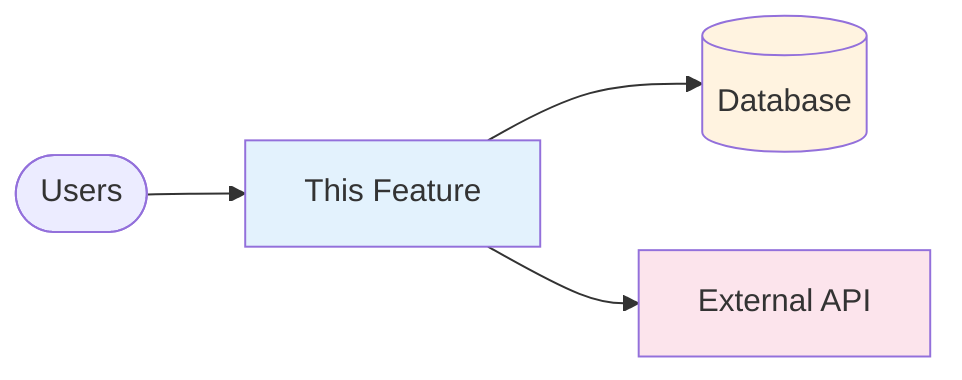
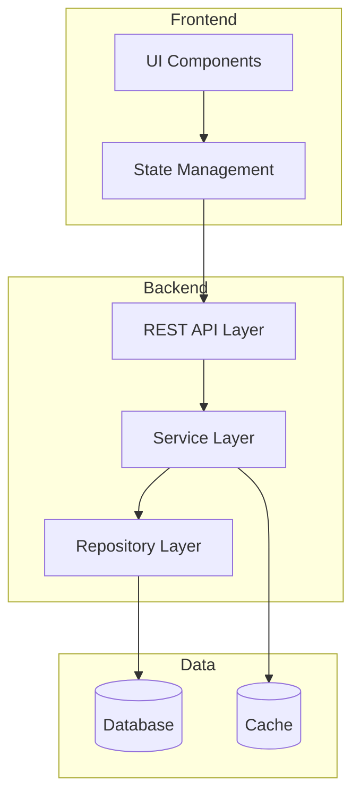

# {{FEATURE_NAME}} - Technical Spec

**Status**: draft | in-review | approved
**Owner**: [Name]
**Created**: {{DATE}}
**Last Updated**: {{DATE}}
**Based on**: `../1-functional/spec.md`

---

## Elegance Guidelines

> **Target size**: 2-3 pages per feature. See [elegance-principle.md](../standards/elegance-principle.md)

**Keep it elegant**:
- ✅ Focus on **architecture decisions**, API contracts, data model
- ✅ Include only **constraints** that matter (performance, security)
- ✅ Use diagrams instead of verbose descriptions
- ❌ Don't specify implementation details Platform AI docs will figure out
- ❌ Don't over-configure (connection pools, cache TTLs unless critical)

**Example - Bloated vs Elegant**:
```yaml
# ❌ Bloated: 200 lines of database config
database:
  connection_pooling:
    pool_size: 20
    max_overflow: 10
    pool_timeout: 30
    recycle: 3600
  query_optimization:
    always_use_prepared_statements: true
    enable_query_cache: true
    cache_ttl: 300
  indexes:
    - table: users
      columns: [email]
      type: btree
      unique: true
    ... (200 more lines)

# ✅ Elegant: What matters
database:
  engine: " MySQL"
  key_entities: ["User", "Task", "Project"]
  critical_queries:
    - "Get tasks by user (< 50ms)"
    - "Search tasks by title (< 100ms)"
```

---

## Spec Reference Annotations (Single Source of Truth)

> **v2.1.0**: If this feature modifies existing technical designs from other features, add explicit reference annotations.

**Reference Types**:
- `<!-- overrides: path#section -->` - Completely replaces existing technical design
- `<!-- extends: path#section -->` - Adds to existing design (backward compatible)
- `<!-- deprecates: path#section -->` - Marks existing design as obsolete

**Example usage**:
```markdown
## Authentication Flow

<!-- overrides: sdd/features/auth-v1/technical-spec.md#authentication-flow -->
The authentication now uses OAuth2 instead of basic JWT.

## Data Model

<!-- extends: sdd/features/user-mgmt/technical-spec.md#user-entity -->
User entity extended with `oauth_provider` and `oauth_id` fields.

## Legacy Endpoint

<!-- deprecates: sdd/features/api-v1/technical-spec.md#legacy-auth-endpoint -->
This endpoint is deprecated and will be removed in v3.0.
```

**When to use**: Only add annotations when this feature intentionally modifies, extends, or deprecates technical designs defined in another feature's spec.

---

## Executive Summary

[2-3 paragraphs summarizing the technical solution]

- Overview of architectural approach
- Key technology choices
- Main components to be built

---

## Architecture Overview

### System Context

Describe how this feature fits into the overall system:



### Component Architecture



---

<!-- IF: greenfield OR brownfield_with_infra_changes -->
##  Platform compliance

| Requirement | Status | Notes |
|-------------|--------|-------|
| Dockerfile exists | ⬜ Pending | Required for  deployment |
| Dockerfile.runtime | ⬜ Pending | For runtime configuration |
| /ping endpoint | ⬜ Pending | Health check endpoint |
| Scopes configured | ⬜ Pending | IAM scopes for service-to-service |

<!-- ENDIF -->

---

##  Services Used

> **For your team teams**: List project services to be used

<!-- IF: greenfield OR brownfield_with_infra_changes OR feature_requires_new_scopes -->
### Authentication & Authorization
- **Service**:  IAM
- **Purpose**: [Why using this service]
- **Integration**: [How it will be integrated]
- **Documentation**: https://the project platform console (from PROJECT.md)/ai/mcp/mcps?id=487d3340-9bd4-41a9-a96e-3db46a958d2a
<!-- ENDIF -->

### [Service Category 2]
- **Service**: [ service name]
- **Purpose**: [Why using this service]
- **Integration**: [How it will be integrated]

[Add more project services as needed]

---

## Custom Implementations

> Components built from scratch (not using project services)

### [Component Name]
- **Why Custom**: [Rationale for not using ]
- **Approach**: [How it will be built]
- **Alternatives Considered**: [Why not using  or other options]

---

## Design Decisions

<!-- Record significant architectural decisions here as ADRs.
     When /sdd.spec technical presents architecture options via AskUserQuestion,
     ALL considered options are recorded here — not just the selected one. -->

### DD-1: [Decision Title]

**Context**: [Why this decision was needed]

**Options Considered**:
- **Option A: [Name]** — [1-line summary]
  - Pros: [List advantages]
  - Cons: [List disadvantages]
  -  Services: [services needed]
  - Complexity: [Low / Medium / High]

- **Option B: [Name]** — [1-line summary]
  - Pros: [List advantages]
  - Cons: [List disadvantages]
  -  Services: [services needed]
  - Complexity: [Low / Medium / High]

**Decision**: Option [X]
**Rationale**: [Why this was the best fit]
**Trade-offs Accepted**: [What we gave up]

---

### DD-2: [Another Decision]

[Follow same structure as DD-1]

---

## Existing Data & Migrations

> **Purpose**: Document pre-existing data considerations and migration strategy.
> Critical for brownfield projects and features that modify existing data.

### Pre-existing Data Assessment

| Aspect | Detail |
|--------|--------|
| **Location** | [Where is current data stored? Service name, table/container] |
| **Volume** | [Approximate count/size of existing records] |
| **Schema** | [Current schema if different from new design] |
| **Last Modified** | [When was schema/data last changed?] |
| **Dependent Systems** | [What else reads/writes this data?] |

### Migration Plan

**Strategy**: [Big-bang / Gradual / Dual-write / Shadow mode]

| Phase | Action | Rollback Plan | Duration |
|-------|--------|---------------|----------|
| 1 | [e.g., Deploy new code with dual-write] | [Disable feature flag] | [X days] |
| 2 | [e.g., Migrate historical data] | [Restore from backup] | [X hours] |
| 3 | [e.g., Switch reads to new store] | [Revert to old read path] | [Instant] |
| 4 | [e.g., Deprecate old store] | [N/A - final phase] | [X weeks] |

### Backward Compatibility

| Aspect | Requirement | Duration |
|--------|-------------|----------|
| **Old API versions** | [Support v1 API for X releases] | [Until date] |
| **Old data format** | [Read old format, write new format] | [Until migration complete] |
| **Old clients** | [Maintain compatibility with clients < v2.0] | [Until forced upgrade] |

### Rollback Impact

> What happens to data created after deployment if we need to rollback?

| Scenario | Impact | Mitigation |
|----------|--------|------------|
| Rollback after X hours | [New records in new format] | [Script to convert back] |
| Rollback after migration | [Mixed data states] | [Full restore from backup] |

---

## Data Model

### New Entities

Define all new database entities/tables:

```typescript
interface Payment {
  id: string;
  userId: string;
  amount: number;
  currency: string;
  status: 'pending' | 'completed' | 'failed' | 'refunded';
  createdAt: Date;
  updatedAt: Date;
  metadata: Record<string, unknown>;
}
```

### Database Schema

```sql
CREATE TABLE payments (
  id UUID PRIMARY KEY DEFAULT gen_random_uuid(),
  user_id UUID NOT NULL REFERENCES users(id),
  amount DECIMAL(10, 2) NOT NULL,
  currency VARCHAR(3) NOT NULL,
  status VARCHAR(20) NOT NULL,
  created_at TIMESTAMP DEFAULT NOW(),
  updated_at TIMESTAMP DEFAULT NOW(),
  metadata JSONB
);
```

### Indexes

```sql
-- Index for user queries
CREATE INDEX idx_payments_user_id ON payments(user_id);

-- Compound index for status queries
CREATE INDEX idx_payments_status_created ON payments(status, created_at DESC);
```

### Migrations

> **⚠️ CRITICAL**: Migrations MUST be created using `your-migration-tool init`. Manual .sql file creation is NOT supported and will break CI.

**Create migrations using  CLI**:
```bash
# For each migration:
your-migration-tool init \
    --service-name <platform-db-service-name> \
    --service-type mysql \
    --file-name create_payments_table

# Creates: ./migrations/mysql/<service-name>/YYYYMMDDHHMMSS_create_payments_table.sql
```

**Planned migrations**:
| Order | File Name | Description |
|-------|-----------|-------------|
| 1 | `create_payments_table` | Create payments table with base columns |
| 2 | `add_payments_indexes` | Add indexes for user and status queries |
| 3 | [Additional migrations] | [Description] |

**Reference**: Run `your-migration-tool init --help` for full flag documentation.

---

## REST API Contracts

### Endpoints

#### POST /api/v1/payments

**Purpose**: Create new payment

**Request**:
```json
{
  "amount": 99.99,
  "currency": "USD",
  "paymentMethod": {
    "type": "credit_card",
    "token": "tok_xxx"
  }
}
```

**Response (201 Created)**:
```json
{
  "id": "pay_123",
  "status": "pending",
  "amount": 99.99,
  "currency": "USD",
  "createdAt": "2025-11-25T10:30:00Z"
}
```

**Errors**:
- `400 Bad Request`: Invalid payment data
- `401 Unauthorized`: Missing or invalid auth token
- `402 Payment Required`: Payment method declined
- `429 Too Many Requests`: Rate limit exceeded
- `500 Internal Server Error`: Server error

**Rate Limiting**: 100 requests/minute per user

**Authentication**: Required ( IAM JWT)

---

#### GET /api/v1/payments/:id

**Purpose**: Retrieve payment details

**Response (200 OK)**:
```json
{
  "id": "pay_123",
  "status": "completed",
  "amount": 99.99,
  "currency": "USD",
  "createdAt": "2025-11-25T10:30:00Z",
  "completedAt": "2025-11-25T10:30:15Z"
}
```

**Errors**:
- `404 Not Found`: Payment doesn't exist
- `403 Forbidden`: User doesn't own this payment

---

[Add more endpoints as needed]

---

## Frontend Web Architecture

> **Only fill this section for `platform.type: frontend-web` projects.**
> Consult `Skill(frontend-web-expert)` for all technical decisions below.

### Rendering Strategy

<!-- Decision per page: SSR full / Islands / Hybrid — justify each choice -->
| Page | Rendering | Rationale |
|------|-----------|-----------|
| `[page-name]` | [SSR / Islands / Hybrid] | [Why this fits] |

### Pages & Component Hierarchy

<!-- Map each user story / flow to Frontend framework pages and components -->
```
pages/
└── [page-name]/
    ├── index.page.tsx          # Page entry point (SSR)
    ├── components/
    │   ├── [ComponentA].tsx    # Purpose: ...
    │   └── [ComponentB].tsx    # Purpose: ...
    └── islands/
        └── [InteractiveWidget].tsx  # Client-side island — why: ...
```

### Frontend framework Modules

<!-- List only the modules this feature uses -->
| Module | Why needed |
|--------|------------|
| `restclient` | HTTP calls to [BFF/API] |
| `i18n` | Translations for [...] |
| `image` | Optimized images for [...] |
| `analytics` | Tracking events for [...] |

### design system Components

<!-- Identified design system components — verify in Skill before coding -->
| Component | Usage |
|-----------|-------|
| `DesignSystemButton` | Primary CTA |
| `DesignSystemCard` | ... |

<!-- Server state (SSR props) vs client state (islands) -->
- **Server state**: [data fetched in getServerSideProps]
- **Island state**: [local state inside interactive components]

### BFF Services

<!-- project services this UI consumes — identify via  -->
| Service | Purpose | Endpoint |
|---------|---------|----------|
| `[platform-service-name]` | [What data it provides] | `GET /api/...` |

---

## Security

> **SDK Reference**: For security components, use project's official Security SDKs.
> SDK catalog provided by `sdd-code-reviewer` if installed.
> If not installed, consult the security team for approved SDK alternatives.

### 🔐 Secrets Management (MANDATORY)

> **BLOCKER**: ALL secrets MUST use  Secrets. Hardcoded secrets will block deployment.

**Secrets Required for This Feature** (passwords, keys, tokens):

| Secret Name | Purpose |  Secret Path |
|-------------|---------|------------------|
| `DATABASE_PASSWORD` | PostgreSQL password | `{app-name}/database-password` |
| `DATABASE_USER` | PostgreSQL username | `{app-name}/database-user` |
| `JWT_SECRET` | Token signing | `{app-name}/jwt-signing-key` |
| `EXTERNAL_API_KEY` | Third-party integration | `{app-name}/external-api-key` |

> ⚠️ **Note**: Secrets use `SECRET_` prefix when read via  Secrets SDK v1.

**Environment Variables (Non-Secret)** - URLs, endpoints, ports, timeouts:

| Variable Name | Purpose | Example Value |
|---------------|---------|---------------|
| `DB_MYSQL_{CLUSTER}_{SCHEMA}_{SCHEMA}_ENDPOINT` | MySQL host:port | `mysql.internal.example.com:3306` |
| `DB_MYSQL_{CLUSTER}_{SCHEMA}_{SCHEMA}_DATABASE` | Database name | `mydb` |
| `CACHE_HOST` |  Cache endpoint | `cache.internal.example.com:6379` |
| `KVS_ENDPOINT` | KeyValueStore service endpoint | `keyvaluestore.internal.example.com` |
| `BIGQUEUE_TOPIC` | MessageQueue topic name | `my-topic` |
| `LOG_LEVEL` | Logging verbosity | `info` |
| `REQUEST_TIMEOUT_MS` | HTTP timeout | `5000` |

> ✅ **Rule**: URLs and endpoints are **NOT secrets**. Only passwords, keys, and tokens are secrets.

**Configuration**:
```yaml
# platform.yml
secrets:
  - name: DATABASE_PASSWORD
    secret: {app-name}/database-password
# Note: Endpoints are automatically injected by  as env vars, no config needed
```

**Code Usage**:
```java
// ✅ CORRECT: Endpoint from env var (no SECRET_ prefix)
String dbHost = System.getenv("DB_MYSQL_CLUSTER_SCHEMA_SCHEMA_ENDPOINT");

// ✅ CORRECT: Password from  Secrets (has SECRET_ prefix in SDK v1)
String dbPassword = System.getenv("SECRET_DB_MYSQL_CLUSTER_SCHEMA_SCHEMA_WPROD");

// ❌ WRONG: Never hardcode passwords
String dbPassword = "password123";
```

**Validation**: `/sdd.check --compliance` will scan for hardcoded secrets.

---

### Authentication & Authorization

- **Method**:  IAM JWT tokens
- **Endpoints**: All `/api/v1/payments/*` require authentication
- **Permissions**:
  - `payments:create` - Create payments
  - `payments:read` - View own payments
  - `payments:refund` - Process refunds (admin only)

### Data Security

- **PII Handling**: Payment data contains PII, must be encrypted at rest
- **PCI Platform compliance**: Use  Payments (PCI-compliant) for card processing
- **Logging**: Never log full card numbers or tokens

### Input Validation

- Sanitize all user inputs
- Validate amount ranges (min: $0.01, max: $10,000)
- Validate currency codes against ISO 4217
- Rate limiting on payment creation (prevent abuse)

---

## Performance

### Targets

- **REST API Response Time**: P95 < 200ms, P99 < 500ms
- **Throughput**: Support 1000 payments/minute
- **Database**: Query time < 50ms for indexed queries

### Optimization Strategies

- **Caching**: Cache payment status with  Cache (TTL: 60 seconds)
- **Database**: Compound indexes on common queries
- **REST API**: Pagination for list endpoints (max 100 items)
- **Frontend**: Lazy load payment history

### Load Testing

- Tool: k6 or Artillery
- Scenarios:
  - Create payment: 100 concurrent users
  - List payments: 500 concurrent users
- Target: Meet performance targets under load

---

## Testing Strategy

### Unit Tests

**Coverage Target**: >90% for business logic

**Key Areas**:
- Payment validation logic
- State management reducers
- Service layer methods
- Repository CRUD operations

**Tools**: Jest, React Testing Library

---

### Integration Tests

**Coverage**: All REST API endpoints with database

**Scenarios**:
- Create payment flow (REST API → Service → Repository → DB)
- Retrieve payment with caching
- Error handling (DB down, external service unavailable)

**Tools**: Jest with test database

---

### E2E Tests

**Coverage**: Critical user flows

**Scenarios**:
- User creates payment successfully
- User views payment history
- Payment failure handling
- Refund flow (admin)

**Tools**: Playwright or Cypress

---

### Performance Tests

- Load test with k6
- Target: Validate performance targets under load
- Run in staging environment

---

## Deployment Strategy

### Rollout Plan

**Phase 1**: Deploy to staging (Week 1)
- Smoke tests
- Technical validation
- Performance testing

**Phase 2**: Canary deployment (Week 2)
- 10% of users via feature flag
- Monitor error rates and performance
- Rollback if error rate > 1%

**Phase 3**: Full rollout (Week 3)
- Gradual increase: 10% → 50% → 100%
- Monitor success metrics
- Keep feature flag for kill switch

### Feature Flags

```yaml
payment-integration-enabled:
  enabled: true
  rollout_percentage: 10
  whitelist: ['user-123', 'user-456']  # Beta testers
  blacklist: []
```

**Tool**:  Feature Flags (ML teams) or LaunchDarkly

### Rollback Plan

**Triggers**:
- Error rate > 5%
- P95 latency > 1 second
- Critical bug discovered

**Actions**:
1. Disable feature flag (immediate)
2. Notify on-call engineer
3. Conduct post-mortem within 24 hours
4. Fix issues in hotfix branch
5. Re-deploy with additional monitoring

---

## Observability

### Logging

**Log Events**:
- Payment created (info)
- Payment completed (info)
- Payment failed (error)
- Refund processed (info)

**Log Format** (structured JSON):
```json
{
  "timestamp": "2025-11-25T10:30:00Z",
  "level": "info",
  "event": "payment.created",
  "paymentId": "pay_123",
  "userId": "user_456",
  "amount": 99.99,
  "currency": "USD",
  "duration_ms": 145
}
```

**Tool**:  DataDog (ML teams) or Winston/Pino

### Metrics

Instrument the following:

- `payment.created.count` (counter)
- `payment.api.latency` (histogram)
- `payment.success_rate` (gauge)
- `payment.amount.total` (counter)

**Tool**:  DataDog, Prometheus, or custom

### Alerting

**Alerts to Configure**:
- Payment success rate < 95% for 5 minutes
- P95 latency > 500ms for 10 minutes
- Error rate > 5% for 1 minute

**Notification**: PagerDuty or Slack

### Distributed Tracing

- Enable OpenTelemetry spans for:
  - API requests
  - Database queries
  - External service calls ( services)

---

## Dependencies

### Internal Dependencies

- **Feature X**: Required for [functionality]
- **Team Y**: Needed for [approval/integration]

### External Dependencies

- **MercadoPago REST API**: For payment processing
- **Third-party service**: [Name and purpose]

### External  API Dependencies (Auto-Discovered)

> This section is auto-populated by `/sdd.spec technical` when external  APIs are detected in the functional spec.

#### [api-name] (e.g., users-api)

**Purpose**: [1-2 sentence description from ]

**Endpoints We Consume**:

| Method | Endpoint | Purpose | Request | Response |
|--------|----------|---------|---------|----------|
| GET | `/users/{id}` | Retrieve user | Path: userId | UserDTO |
| POST | `/users/validate` | Validate token | Body: token | ValidationResult |

**Integration Details**:

| Aspect | Value | Notes |
|--------|-------|-------|
| **Base URL** | `https://[api-name].apps.example.com` | |
| **Auth** |  IAM service-to-service | Scope: `[scope-name]` |
| **Timeout** | 500ms | Recommended default |
| **Rate Limit** | [X] req/min | Per application |
| **SLA** | [99.X%] uptime, [Xms] p95 | From service docs |
| **Contact** | [Team/Slack channel] | For escalations |

**Error Handling & Retry Policy**:

| Status | Meaning | Retryable? | Max Retries | Backoff | Our Action |
|--------|---------|------------|-------------|---------|------------|
| 400 | Bad request | No | 0 | N/A | Log error, return 400 |
| 401 | Unauthorized | Once | 1 | N/A | Refresh token, retry |
| 403 | Forbidden | No | 0 | N/A | Log, alert, fail |
| 404 | Not found | No | 0 | N/A | Return 404 to caller |
| 408 | Timeout | Yes | 3 | Exponential | Retry with backoff |
| 429 | Rate limited | Yes | 3 | Exponential | Wait for Retry-After |
| 500 | Server error | Yes | 3 | Exponential | Retry with backoff |
| 502/503/504 | Gateway/Unavailable | Yes | 3 | Exponential | Retry with backoff |

**Circuit Breaker Configuration**:

| Setting | Value | Rationale |
|---------|-------|-----------|
| Failure threshold | 5 failures in 30s | Open circuit after 5 consecutive failures |
| Recovery timeout | 30 seconds | Time before attempting to close circuit |
| Half-open requests | 1 | Single request to test recovery |

**Fallback Strategy**:

| Scenario | Fallback Action | User Impact |
|----------|-----------------|-------------|
| Circuit open | [Return cached data / Use default / Fail gracefully] | [Describe degraded experience] |
| All retries exhausted | [Queue for later / Return partial / Fail with message] | [Describe user experience] |

**Source**:  (auto-discovered on {{DATE}})

---

> **If NOT_FOUND in **: Remove "Auto-Discovered" label and document manually.

### External Non- APIs (if applicable)

> Document third-party APIs not in  ecosystem.

#### [external-api-name]

| Aspect | Value |
|--------|-------|
| **Documentation** | [URL to API docs] |
| **Environment URLs** | Dev: [X], Staging: [Y], Prod: [Z] |
| **Authentication** | [Bearer / API Key / OAuth2 / mTLS] |
| **Credentials Location** |  Secrets: `{app}/[secret-name]` |
| **Rate Limit** | [X] req/sec (per key) |
| **SLA** | [If known, from contract] |
| **Support Contact** | [Email / Slack / Ticket system] |

**Error Codes Specific to This API**:

| Code | Meaning | Retryable? | Our Action |
|------|---------|------------|------------|
| [Custom code] | [Meaning] | [Yes/No] | [Action] |

### Infrastructure

- **New Resources**:
  -  Cache cluster for caching
  - S3 bucket for receipts: `s3://company-payments-prod`
  - MessageQueue topic for payment events

---

## Complexity Analysis

### Component Breakdown

| Component | Complexity | Dependencies |
|-----------|------------|--------------|
| Data Model + Migrations | Low | - |
| API Layer | Medium | Data Model |
| Frontend Components | Medium | API Layer |
| State Management | Low | API Layer |
| Integration Testing | Medium | All above |
| E2E Tests | Medium | Integration |
| Documentation | Low | - |

### Execution Strategy

- **Sequential**: ~80K tokens (minimal context)
- **Batched**: ~100K tokens (recommended)
- **Parallel**: ~140K tokens (maximum parallelization)

---

## Technical Risks

| Risk ID | Description | Impact | Probability | Mitigation |
|---------|-------------|--------|-------------|------------|
| TECH-1 | Database performance under load | High | Medium | Add indexes, caching layer, load testing before launch |
| TECH-2 | External payment API downtime | High | Low | Circuit breaker pattern, retry logic, fallback queue |
| TECH-3 | State management complexity | Medium | High | Pair programming, code reviews, comprehensive tests |

---

## Open Questions

- [ ] Should we use GraphQL instead of REST?
- [ ] Do we need CDC (Change Data Capture) for analytics?
- [ ] What's the data retention policy for old payments?

---

<!-- IF: brownfield -->
## Code Ownership Map

> **Brownfield only**: Maps architectural components to their owning files.
> Generated by `/sdd.reverse-eng` Phase 4.5. Helps identify affected files for new features.

| Component | Role | Primary Files (0.8-1.0) | Supporting (0.5-0.79) | Shared (0.2-0.49) |
|-----------|------|------------------------|----------------------|-------------------|
| [Component] | [API/Service/Data/Client] | [files] | [files] | [files] |

**Reading this map**:
- **Primary (0.8-1.0)**: File IS the component. Changes here are component-specific.
- **Supporting (0.5-0.79)**: File is directly used by this component. May need changes too.
- **Shared (0.2-0.49)**: File is used by multiple components. Changes may have wider impact.
<!-- ENDIF -->

---

## Implementation Locations

> **v2.3.0**: Bidirectional traceability between specs and code.

<!-- AUTO-GENERATED by /sdd.build - Do not edit manually -->

This section is automatically populated by `/sdd.build` as tasks are completed. It maps spec sections to their implementation files.

| Spec Section | Implementation Files |
|--------------|---------------------|
| *Auto-populated during build* | |

**Format**:
- Each row maps a technical spec section to its implementing file(s)
- Files are listed by path relative to project root
- Multiple files are comma-separated

**Code → Spec References**:

Implementing code should include `@spec` comments pointing back to this spec:

```typescript
/**
 * @spec {{FEATURE_NAME}}#authentication
 * @implements US-1, US-2
 */
export class AuthService {
```

Where `{{FEATURE_NAME}}` is the feature directory name (stable between `wip/` and `features/`).

---

## References

- **Functional Spec**: `../1-functional/spec.md`
- **Architecture Diagrams**: `./architecture.md`
- **Project Standards**: See `sdd-kit-expert` framework standards
- ** Guidelines**: See `sdd-kit-expert` code compliance documentation
- **ADRs**: [Links to related Architecture Decision Records]
